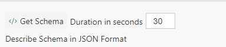

The Cloud simulator provides data to an Event or IoT hub enabling developing rules and queries, emulating production data flowing into an environment.  In this tutorial you will learn how to:
* Update the schema of the generated data
* Create rules to generate special conditions such as drops/increases in data (future)

# Steps to follow
* Open iotsample.json file in your Azure storage account (Container: samples, Path: iotdevice/iotsample.json)
* Notice the 'fields' property. This is where we define the schema. Following lists out the supported properties - 
  * **name** - Name of the field.
  * **type** - Data type of the field. Supported types - struct, long, int, double, decimal, string, array, datetime.
  * **properties** - For a field of type struct, this holds an array of properties
  * **minRange / maxRange** - A random number between the min and max range is set as value of the field.
  * **valueList** - Applies to a field of type string, valueList is an array of strings from which a value is randomly chosen.
  * **utcAddSeconds** - Applies to a field of type datetime, this adds the specified number of seconds to current utc time.
  * **datetimeStringFormat** - Applies to a field of type datetime, format of DateTime.
  * **castAsString** - For non string type fields, if the value of the property needs to be specified within quotes then set this flag to true.
  * **value** - For properties that will not have random value, set the value here.
  * **length** - Applies to a field of type array, this is the length of array
* Notice the 'rulesData' property. This is where we define the data streams that the simulator should generate in order to trigger the rules condition. Here we set constant values for each property. Following lists out the supported properties -
  * **dataStream** - Stream of data that the simulator will generate.
  * **triggerConditions** - Array of rules triggering conditions.
  * **parentJsonPropertyPath** - Parent JSON proerty path for which the value needs to be set
  * **propertyName** - Property name for which the value needs to be set
  * **propertyType** - Property type for which the value needs to be set
  * **castAsString** - Flag to cast the value of non-string type property to string 
  * **ruleTriggerMinRange** - Min value of the property for which the the rule will trigger an alert where value is within a range
  * **ruleTriggerMaxRange** - Max value of the property for which the the rule will trigger an alert where value is within a range
  * **ruleNotTriggerMinRange** - Min value of the property for which the the rule will not trigger an alert where value is within a range
  * **ruleNotTriggerMaxRange** - Max value of the property for which the the rule will not trigger an alert where value is within a range
  * **ruleTriggerValue** - Value of the property for which the rule will trigger an alert
  * **ruleNotTriggerValue** - Value of the property for which the rule will not trigger an alert
  * **ruleNotTriggerTimeInMinutes** - Instances in minutes where the rule is not expected to trigger an alert
  * **utcAddSeconds** - Number of seconds to add to current utc time in case of a datetime type property
  * **datetimeStringFormat** - DateTime format in case of a datetime type property
* Following is the list of some other properties used to shape up the simulation process
  * **rulesCounterRefreshInMinutes** - Time in minutes to reset the rules counter.
  * **simulationPeriodInMinute** - Period in minutes for how often the data will be simulated. Value set here as 1 will mean that data will be simulated every minute.
  * **numEventsPerBatch** - Number of events to simulate in each batch.
* Update the iotsample.json file to fit the data you need.
* Open DataX.SimulatedData solution on Visual Studio in Admin Mode.
* Update the PublishProfile and ApplicationParameters for DataX.SimulatedData service depending upon your environment so as to publish the service to your service fabric cluster.
* Publish the service to your service fabric cluster.
* Go to your Flow, in the input tab click "GetSchema" button. This will sample the data for the number of seconds specified and infer the schema of the incoming data. This will update your Flow's schema to match the generated data 
  

* Click "Deploy" button to save and run the Flow.  
  

# Links
* [Tutorials](Tutorials)
* [Wiki Home](Home) 