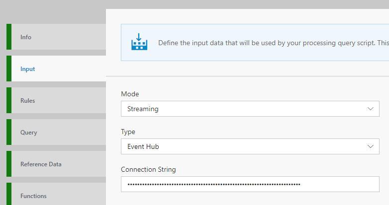
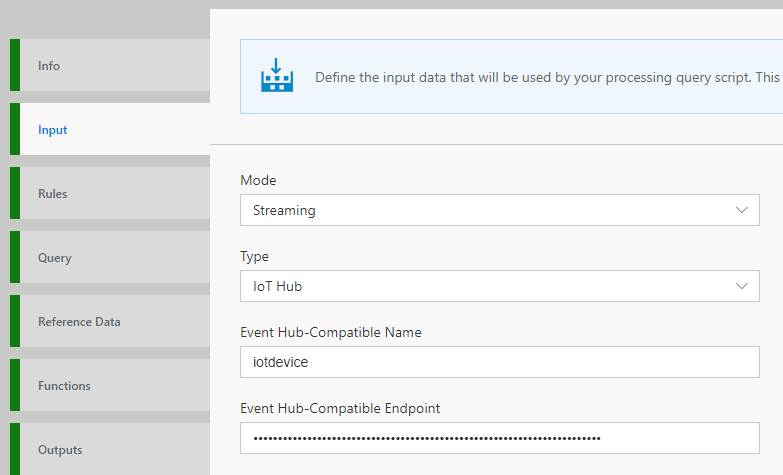
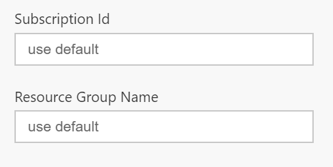
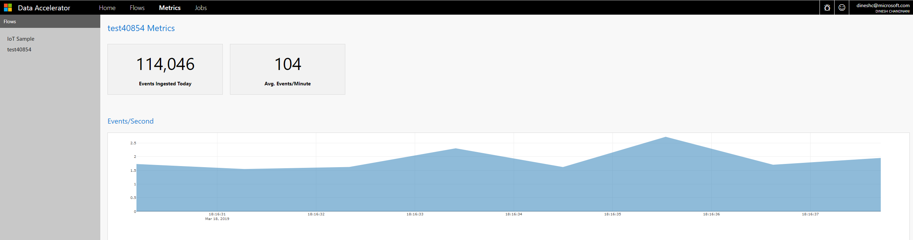

One you have completed the [deployment of Data Accelerator](https://github.com/Microsoft/data-accelerator/wiki/Cloud-deployment) to your subscription, you are ready to create your first Flow! In this tutorial you will learn how to:
* Create a new Flow
* Configure input source of data (Supported today: Eventhub, IoTHub, Kafka and Kafka eventhub)
* Inspect schema of incoming data
* Deploy and run the Flow

# Steps to follow
* Open Data Accelerator portal and go to the Flows tab

* Click on "New" on the Flows tab, this will create a new Flow:  
 

* Switch to the Input tab and select input type you want to receive data from. Data Accelerator supports Eventhub and IoThub

* Enter the Connection string for an Eventhub or Kafka Event Hub, or Eventhub-Compatible Name and Endpoint for an IotHub. For Kafka and kafka event hub, you can provide the topics separated by commas.  For Kafka, the url:port information of each node can be provided separated by a comma.  
* To get this information login to the [Azure portal](https://portal.azure.com). In the subscription where you deployed Data Accelerator, check the resources and you will notice that an IoThub has also been provisioned that you can use for this example. Open the 'Built-in endpoints' of the IoThub to get the needed information. Note, sample data is already flowing into this IoThub.   
_Input type:Eventhub_ 
   
_Input type:IoThub_ 
  

- If the IoThub or Eventhub that you are connecting to lives in another resourcegroup, or in another subscription but same tenant, please provide the Subscription Id and Resource group name as well.   
  

- If the IoThub or Eventhub lives in another tenant instead, then follow [these steps](https://github.com/Microsoft/data-accelerator/wiki/Use-Input-in-different-tenant) before proceeding.  

* Click "GetSchema" button. This will sample the data for the number of seconds specified and infer the schema of the incoming data. The data is an example of home automation data.   
  

* Click "Deploy" button to save and run the Flow. That's it! You have created your first end to end data streaming pipe!  
  

# View Metrics
Now switch to the Metrics tab and you will see metrics for rate of events coming in and number of events ingested!  
  

# Links
* [Tutorials](Tutorials)
* [Wiki Home](Home) 