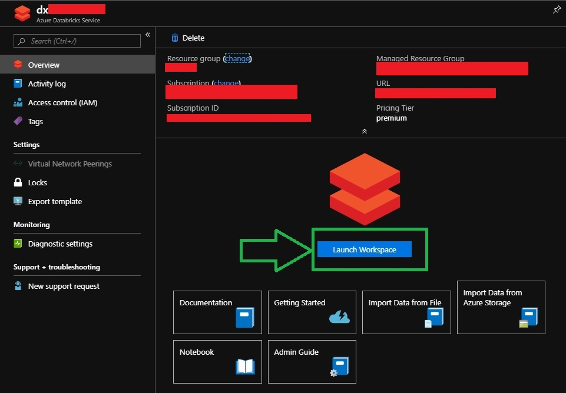
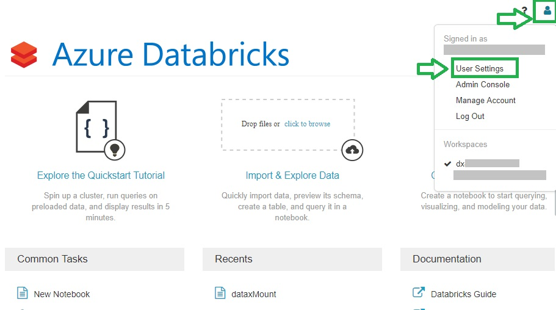
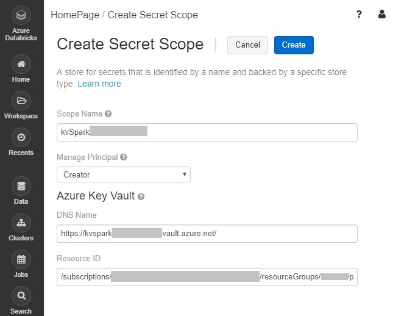
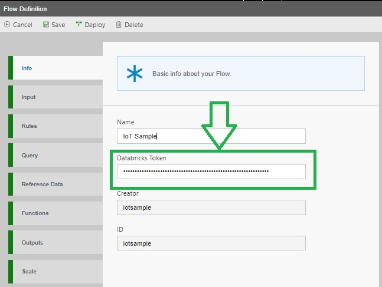
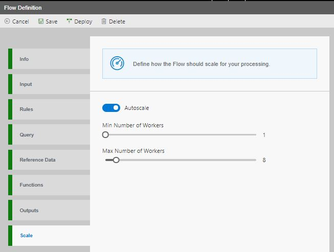

Data Accelerator environment can now be set up to run jobs on either Databricks or HDInsight. During the time of setting up the Data Accelerator environment, you can choose the platform on which you would want to run the spark jobs – Databricks or HDInsight. 

In this tutorial we will go over:
* [How to setup Data Accelerator environment that uses Databricks](#data-accelerator-with-databricks-environment-setup)
  * [ARM Deployment](#arm-deployment)
  * [Generate Databricks Token](#generate-databricks-token)
  * [Create secret scope](#create-secret-scope)
  * [Upload jar files to DBFS](#upload-jar-files-to-dbfs)
  * [Create Databricks Cluster for Live Query](#create-databricks-cluster-for-live-query)
* [How to run Data Accelerator flows on Databricks](#run-data-accelerator-flows-on-databricks)
  * [Set Databricks Token](#set-databricks-token)
  * [Set Scale](#set-scale)

# Data Accelerator with Databricks Environment Setup

### Prerequisites
* Install Azure CLI from [here](https://docs.microsoft.com/en-us/cli/azure/install-azure-cli?view=azure-cli-latest)
* Install Databricks CLI from [here](https://docs.databricks.com/user-guide/dev-tools/databricks-cli.html#install-the-cli)
* Download the scripts and templates locally via this link: [template](https://github.com/Microsoft/data-accelerator/tree/stable/DeploymentCloud)

### ARM Deployment
* Open common.parameters.txt under DeploymentCloud/Deployment.DataX, provide **TenantId** and **SubscriptionId**. Also set **useDatabricks** = y 
* For Windows OS, open a command prompt as an admin under the downloaded folder DeploymentCloud/Deployment.DataX and run :
```
deploy.bat 
```
* If you are not the admin of the tenant (typically when using AAD account), then please copy over the DeploymentCloud folder to your admin's machine and ask your admin to run the following command:
```
runAdminSteps.bat
```
The above steps will setup the azure resources required by Data Accelerator. A Databricks resource will also be created. To finish setting up databricks resource you will further need to generate databricks token, create a secret scope, upload jars to DBFS which are required to run spark jobs and finally create a databricks cluster for live query.

### Generate Databricks Token
The following steps will instruct you through the steps required to create a Databricks token. This databricks token will be required to run Databricks CLI commands which we will go over later in the setup process and for running flows on databricks.   
* On https://portal.azure.com, go to the ‘Azure Databricks Service’ resource created by the ARM deployment step and click on ‘Launch Workspace’.

* On Databricks portal, click on Account and select User Settings. Then click on the ‘Generate New Token’ button. 

* You can set the lifetime of token here or choose the default lifetime and click ‘Generate’. Please copy the token as this token will be required later and you will not be able to see the token again.

### Create secret scope
Here we will be creating an Azure Key Vault-backed secret scope which will be required to read secrets from Azure Key Vault. 
* On https://portal.azure.com, go to the ‘Key vault’ resource named ‘kvSpark****’. **Note**: Do not go to the key vault that has RDP in the name.
  * Click on Properties blade and copy following. 
    * Name
    * DNS Name
    * Resource ID
* Go to https://<your_azure_databricks_url>#secrets/createScope (for example, https://eastus.azuredatabricks.net#secrets/createScope) and paste the info copied from above step:
  * Key Vault Name as ‘Scope Name’
  * DNS Name
  * Resource ID


### Upload jar files to DBFS
We will be running DBFS CLI command to upload the jar files to Databricks File System. These jars are required by Data Accelerator spark jobs. To run the following steps, first [Install Databricks CLI](https://docs.databricks.com/user-guide/dev-tools/databricks-cli.html#install-the-cli) if you have not done so and then [set up authentication](https://docs.databricks.com/user-guide/dev-tools/databricks-cli.html#set-up-authentication) using the databricks token that we generated in the previous step.
* Unpack [Microsoft.DataX.Spark](https://www.nuget.org/packages/Microsoft.DataX.Spark) Nuget package 
* Open powershell. Enter the folder path of extracted nuget package in the command below and run it.
```
dbfs cp -r <path of extracted Microsoft.DataX.Spark>\lib dbfs:/datax
```
* To verify that all the jars got uploaded, you can run following and it will list out the files
```
dbfs ls dbfs:/datax -l –absolute
```

### Create Databricks Cluster for Live Query
We will now create a dedicated cluster to run live queries. In the following script, set values of $clusterName and $defaultVaultName in the first two lines and run the script.
```
$clusterName = '<Enter your databricks workspace name here eg:dx123>'
$defaultVaultName = '<Enter spark keyvault name that was used to create secret scope eg:kvSpark123>'

$jsonCommand = '{
	\"cluster_name\": \"' + $clusterName + '\",
	\"spark_version\": \"5.3.x-scala2.11\",
	\"node_type_id\": \"Standard_DS3_v2\",
	\"autoscale\": {
		\"min_workers\": \"2\",
		\"max_workers\": \"8\"
	},
	\"autotermination_minutes\": \"0\",
	\"spark_conf\": {
		\"spark.databricks.delta.preview.enabled\": true,
		\"spark.sql.hive.metastore.version\": \"1.2.1\",
		\"spark.sql.hive.metastore.jars\": \"builtin\"
	},
	\"spark_env_vars\": {
		\"DATAX_DEFAULTVAULTNAME\": \"' + $defaultVaultName + '\"
	}
}'
$clusterId = (databricks clusters create --json $jsonCommand | ConvertFrom-Json).cluster_id
$dbfsFiles = (dbfs ls dbfs:/datax --absolute)
foreach($dbfsFile in $dbfsFiles) {
    databricks libraries install --cluster-id $clusterId --jar $dbfsFile
}
```
It can take about 10 minutes for the cluster to start

# Run Data Accelerator Flows on Databricks
Open Data Accelerator Portal via https://_name_.azurewebsites.net (Url available via the Azure Portal under the deployed App Service. To find this, go to App Services in https://portal.azure.com, click on the app service called "dx*", and open the URL). Click on the Flows TAB to see the list of sample flows and select any sample flow

### Set Databricks Token
On the Info TAB, you will notice a 'Databricks Token' textbox which is specific for databricks environment and does not show up on HDInsight environment. Enter your databricks token generated using [these steps](#generate-databricks-token) here.


### Set Scale
Switch to Scale TAB. Here you can enable/disable Autoscale and also set number of workers for each flow. Once deployed, each flow will run on its own databricks cluster. If Autoscale is enabled then the cluster will autoscale between the min and max no. of workers (as specified in the flow) depending upon the cluster load. If autoscale is disabled then the cluster will continue to use a constant number of workers irrespective of the cluster load. 
  

Click the deploy button and this will start the job on Databricks. You can view the charts on the Metrics TAB of Data Accelerator Portal.