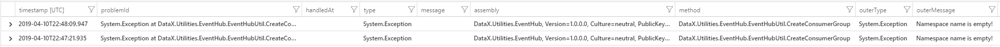

# Diagnose and monitor the backend services and Data-Accelerator's Data Processing component using ApplicationInsights
If for some reason, one of the "Deploy" or "GetSchema" (etc.) buttons are giving an error in the Data Accelerator portal, for diagnosing such an issue, it is extremely useful to look at the telemetry logs via [ApplicationInsights](https://docs.microsoft.com/en-us/azure/azure-monitor/app/app-insights-overview#what-does-application-insights-monitor). This can prevent having to setup the debugging environment. Just by looking at the logs, one can figure out the issue that may be happening. 
Currently, the backend services and DataAccelerator's DataProcessing component send ApplicationInsights telemetry.  
To access the logs, you can go to the portal.azure.com and open up the Applicationinsights instance--> click on [Analytics](https://docs.microsoft.com/en-us/azure/azure-monitor/app/analytics)  

## Scenario 1: GetSchema
In the Data Accelerator portal if you are trying to [GetSchema](https://github.com/Microsoft/data-accelerator/wiki/Creating-your-first-pipeline-in-5-minutes!#steps-to-follow), you can look at the ApplicationInsights logs and get details for this call (especially in case you run into an error). For looking at the logs you need to go to the Azure portal --> ApplicationInsights resource and click on [Analytics](https://docs.microsoft.com/en-us/azure/azure-monitor/app/analytics).
In this case, you are in the Input tab on Data Accelerator portal. Let's say if you entered the wrong connection string, the backend api will return an error message. Based on this error message, you can double check the entered connectionString on the DataAccelerator portal and modify / update it.
##### Useful queries:
  - Look at the Error logs:
    ```
    exceptions 
    | order by timestamp desc 
    | where operation_Name  contains "POST SchemaInference/GetInputSchema"
    ```
Example output:

     
  - Look at the traces logs:
    ```
    traces 
    | order by timestamp desc 
    | where operation_ParentId contains "datax-service" 
    | where operation_Name  contains "POST SchemaInference/GetInputSchema"
    ```
## Scenario 2: Live Query Initialization
Please refer to the tutorial on [Live Query](https://github.com/Microsoft/data-accelerator/wiki/Live-query#steps-to-follow) Once you click on an existing flow, the Jupyter kernel is initialized. If there was an error / exception while the kernel was getting initialized, you will see an error on the query tab. For more details, you can go to ApplicationInsights on the Azure portal and issue the below queries to look at the telemetry data. This will help you debug the issue. The recommendation is that if the kernel has not initialized correctly. Steps to follow:
  - Click on GetSchema in the Input tab. If there is an error, check Application Insights Telemetry to debug why GetSchema is failing
  -  Once GetSchema succeeds, this will automatically trigger kernel initialization. If there is an error, go to the Azure portal --> ApplicationInsights resource and click on [Analytics](https://docs.microsoft.com/en-us/azure/azure-monitor/app/analytics).
 ##### Useful queries:
  - Look at the Error logs:
    ```
    exceptions 
    | order by timestamp desc 
    | where operation_Name contains "POST InteractiveQuery/CreateAndInitializeKernel"

    ```
Example output:

     
  - Look at the traces logs:
    ```
    traces 
    | order by timestamp desc 
    | where operation_ParentId contains "datax-service" 
    | where operation_Name contains "POST InteractiveQuery/CreateAndInitializeKernel"
    ```
## Scenario 3: Deploy
In the Data Accelerator portal if you are trying to [Deploy your flow](https://github.com/Microsoft/data-accelerator/wiki/Creating-your-first-pipeline-in-5-minutes!#steps-to-follow), you can look at the ApplicationInsights logs and get details for this call (especially in case you run into an error). For looking at the logs you need to go to the Azure portal --> ApplicationInsights resource and click on [Analytics](https://docs.microsoft.com/en-us/azure/azure-monitor/app/analytics).
In this case, you are in the Input tab on Data Accelerator portal. Let's say if you entered the wrong connection string, the backend api will return an error message.
##### Useful queries:
  - Look at the Error logs:
    ```
    exceptions
    | order by timestamp desc
    | where operation_ParentId contains "datax-service" 
    | where operation_Name contains "FlowManagement" 
    ```
  
## Want to enhance what's getting logged in the backend services?
We are using the ILogger implementation and the ILogger instance (_logger) is available in each of the classes in the backend services. 
Example: 
  ```
  _logger.LogInformation($"Event count = {events.Count}");
  ```
Whereever you feel that the logs should be added, a similar call can be made.

## Want to filter telemetry that is being sent?
For each of the backend services, for example, DataX.Flow service you can filter additional telemetry in StartUpUtil.cs.
   ```
   services.AddLogging(logging =>
   {
     try
     {
        // In order to log ILogger logs
        logging.AddApplicationInsights();
        // Optional: Apply filters to configure LogLevel Information or above is sent to
        // ApplicationInsights for all categories.
        logging.AddFilter<ApplicationInsightsLoggerProvider>("", LogLevel.Information);

        // Additional filtering For category starting in "Microsoft",
        // only Warning or above will be sent to Application Insights.
        logging.AddFilter<ApplicationInsightsLoggerProvider>("Microsoft", LogLevel.Warning);
     }
   ```  
Please note: This will require a redeployment of the services.
##### More details on ILogger and ApplicationInsights at the below links:
  - [ILogger](https://docs.microsoft.com/en-us/azure/azure-monitor/app/ilogger)
  - [Filter Rules in code](https://docs.microsoft.com/en-us/aspnet/core/fundamentals/logging/?view=aspnetcore-2.2#filter-rules-in-code)