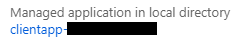

With Data Accelerator, you can invite others to view or create data pipelines in your installation of Data Accelerator. Data Accelerator gives you control over who you invite and what role you assign them. In this tutorial you will learn how to do so.

# Steps to follow
- By default if someone navigates to your Data Accelerator portal, they will need to sign-in, and if they don't have the permissions, they will get an error message when they visit Flows, Metrics, etc. pages.  
 

- To invite and give access to someone, sign in to [Azure portal](https://portal.azure.come)

- Click on 'Azure Active Directory', then click on Users. 
 

- Click on 'New Guest User' button 
 

- Next, fill in the Email ID of person you would like to invite and then click the 'Invite' button. This will send an invitation to the person you would like to invite.

- Next, you need to assign a role to the person being invited. To do so, click on 'Azure Active Directory' from the left pane again, and click on 'App Registrations' 
 

- If you see the following, click on 'View all applications' button 
 

- You will see 2 applications: clientapp-* and serviceapp-*. For each app in turn, do the following:
    - Click on the app name
    - Click on the app name under Managed application in local directory 
 
    - Click on 'Users and groups' and then on '+ Add user'
    - Select User and then the Role (DataXReader or DataXWriter). DataXReader gives read permissions ony, while DataXWriter has both read and write permssions.
    - Make sure to repeat the above steps for both clientapp-* and serviceapp-*

- Now you have successfully invited other users to your deployment of Data Accelerator and controlled what they are able to do. Make sure to ask them to sign-out and sign-in to the Data Accelerator portal for them to be able to pick up the new role changes (deleting cookie for the site also works).

# Links
* [Tutorials](Tutorials)
* [Wiki Home](Home) 