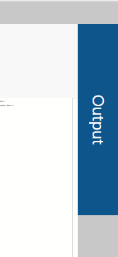
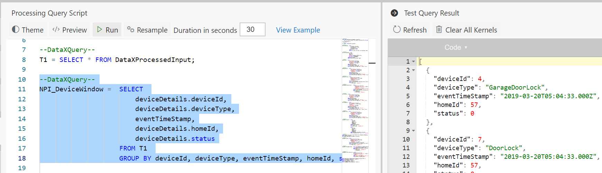
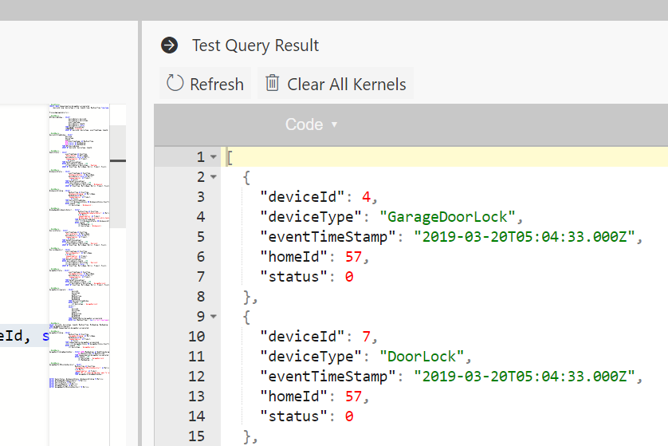

It can be very frustrating when one writes some queries, deploys the Spark job to only later find out that there was a typo or a missing semi-colon. This can easily take up 10 to 15 minutes for each change requiring deployment, waiting for job to run, going through logs to determine why job failed, etc. To tighten this development loop, and reduce the time from minutes to seconds, Data Accelerator supports "Live Query".

What if you could run your query against a sample of the incoming streaming data and validate the output in seconds? Now you can! In this tutorial, you will learn how to. 

# Steps to follow
- Open a Flow or create a new one using [first tutorial to create a pipeline in 5 minutes](Creating-your-first-pipeline-in-5-minutes!)

- Write the following code in the Query tab. note DataXProcessedInput is the default table for the incoming data and has the schema defined in the Input tab. In addition it has _SystemProperties and _Properties <br/>

```sql
T1 = SELECT * FROM DataXProcessedInput;
```

- Click on the Output button on the far right in the Query tab. If the live query session is still being initialized, it will say so.<br/>
<br/>

- Now select SQL query and click 'Run' button on the top of the editor. This will run the query against sample data from the input stream and show the results in a few seconds in the Output section we just opened up!<br/>
<br/>

- Go ahead and write more queries and validate them immediately. 

**Notes**
- For the home automation Flow, the sample data is dropped at the time of deployment. However, if you want to refresh the sample, you can do so anytime, by clicking the "Resample" button and specifying how long you want to sample the data for. Default is set.

- Debugging session lasts for 3 hours. If that is exceeded, your session may expire, and you may get error message such as unable to execute code or session ended. When that happens, click on 'Refresh' button to instantiate a new debugging session.<br/>
<br/>

- Depending on the number of Flows and debugging sessions running on the cluster, and the capacity of the cluster itself in terms of cores and memory, you could run out of capacity to instantiate more debugging sessions. When this happens, you get error message such as "Session ended" or "Unable to instantiate kernel". When you run into this situation, you can choose to kill all the debugging sessions that are active by clicking on 'Clear All Kernels', thus freeing up the cluster and allowing you to get a session. Note, this will not kill the Flows deployed, but only the debugging sessions. 

# Feedback
Let us know what you think about this feature, what worked, and what else you would like to see. 

# Links
* [Tutorials](Tutorials)
* [Wiki Home](Home) 

 