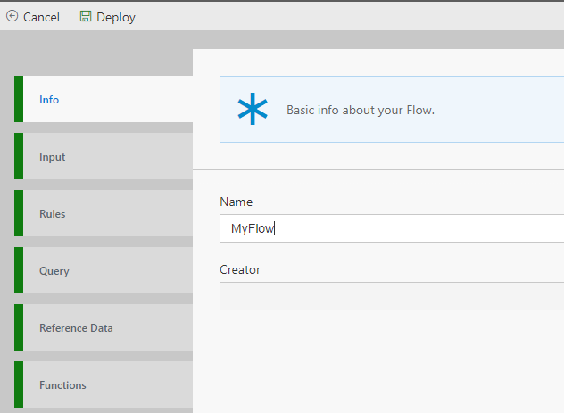
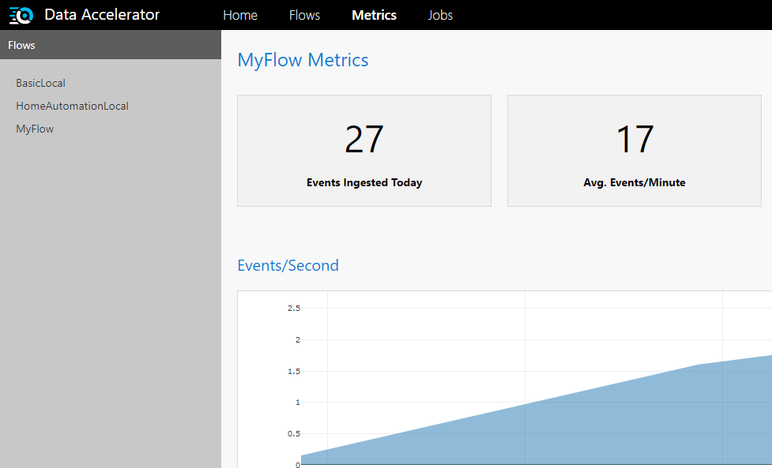

Once you have completed the local installation instructions here, you are ready to start setting up a pipeline locally.

In this tutorial, you'll learn to:
 - Create a Flow
 - View the Metrics dashboard

# Creating a Flow
 - Ensure the http://localhost:49080 site is opened to the DataX Portal
 - Click on "New" on the Flows tab, this will set up a basic flow: 
 

 - The Info tab has the Flow name.  We'll need that in the next step.

 - Click Deploy to start the flow.  That's it! 

# View the metrics
 - You can open the metrics tab; this tab will help visualize your data and validate query changes.
	

You have now created a pipeline with visualization of the incoming data.

* [Next tutorial : Alerts](https://github.com/Microsoft/data-accelerator/wiki/Local-Tutorial-2-Add-an-Alert/_edit)

# Other Links
* [Tutorials](Tutorials)
* [Wiki Home](Home) 