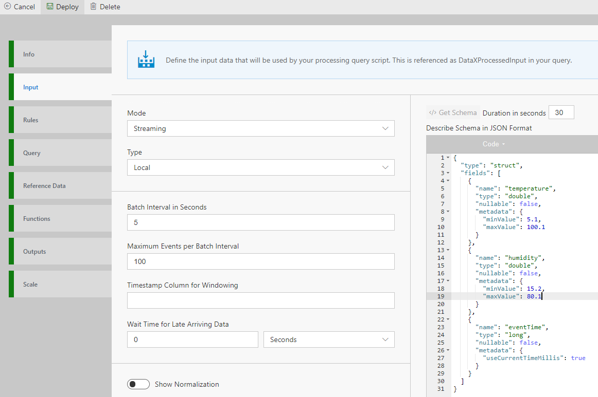

# Update the Schema of generated data

Next, we can update the schema of the test data:
 - Open existing flow
 - Go to Input tab
 - In the schema section, edit the text.  To add a value, add the following:
		{
			name : <name of the column>,
			type : <type, can be double, int, string, etc>,
			nullable : <if value can be null, true or false>,
			Metadata : { 
				minValue : <for decimals, floor value for which the generated data will stay above>,
				maxValue : <for decimals, ceiling value for which the generated data will stay under>
			}
		}
	NOTE: For double datatype, value should be double value like 15.1. Also due to issue with JSON editor which rounds off 0s after decimal, make sure the value after decimal is > 0. ie. 15.0 won't work, make it 15.1.
	

 - Click save
	
You now have the pipeline running with your custom data and able to view basic data on the Metrics dashboard.  See the next tutorial on how you can use the new data in Rules and setting up alerts!  See Tutorial 1 to add Rules and Alerts!

# Samples

The docker image has two samples, to start them, you can go to the Flow pages, and click "Deploy" (After making a change either in the query, or title of it).  This will start populating the metrics page for them.  You can use the Query or Rules tab as reference.

# Data generation hints

Following data generation hints are supported (in local mode) based on data type via metadata tag:

Numbers (int, long, float, double)

  "metadata": {
        "minValue": 5.1,
        "maxValue": 100.1
      }

  "metadata": {
        "allowedValues": [1,2,3,5,7]
      }

// this is only for long type. This will generate timestamp value in milliseconds
  "metadata": {
        "useCurrentTimeMillis": true
      }

String , Array, Map (control the length of data generated)

 "metadata": {
        "maxLength": 9
      }

Apart from these data types, boolean and struct data types are also supported in local mode.
