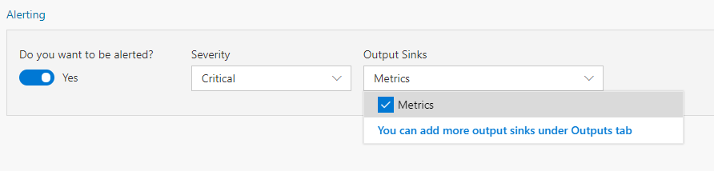
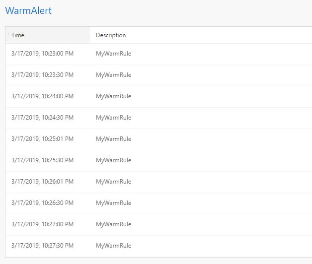

Often, you want to be alerted based on certain conditions being met in the streaming data. Data Accelerator makes it very easy to do so, without having to write any code. In this tutorial, you'll learn to:
 - Create a an alert and an aggregated alert without writing code

# Creating an alert

 - Open your Flow
 - Go to Rules tab, and click Add a "Tag Rule".  

 -  Set a Description for the rule and a tag to describe the rule
 -  The target table is DataXProcessedInput, which is the default table that DataX creates with the raw data.  (Note, once you create new tables in the Query tab, explained in subsequent tutorial, the new tables will also be available to create rules and alerts against.)

 
 -  In conditions, select the column of data to monitor and set the condition to measure against.  i.e. select 'temperature' in the column, select '>' and 60.  This would trigger the rule when the temperature value is above 60.
 -  To create an alert on this condition, set "Do you want to be alerted" to 'Yes'.  
 -  You can select Metrics in the output to view the alerts on the Metrics dashboard.  
 

 -  Click Deploy to have the changes take effect
 -  You can view the alerts you have set up by going to the Metrics tab.  Alerts will be displayed in a table on the metrics page.

You now have update your pipeline to create alerts.  
* [Next tutorial : Aggregate Alerts](https://github.com/Microsoft/data-accelerator/wiki/Local-Tutorial-3-Advanced-Aggregate-alerts)

# Other Links
* [Tutorials](Tutorials)
* [Wiki Home](Home) 