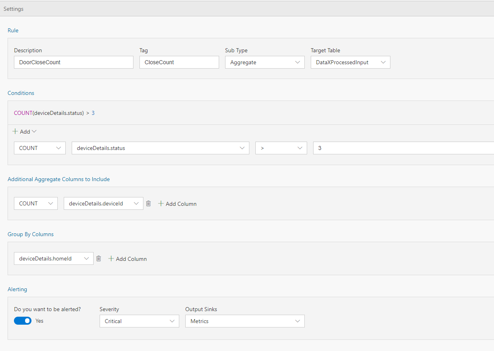

In the previous example we walked through how to set up a simple alert. At times, there is a need for setting up an alert, not based on the current value, but an aggregate value (such as min, max, average, etc.). In this tutorial you will learn how to set up an alert for aggregated values, without writing any code. 

# Steps to follow
* Open your flow 
* Switch to Rules tab and click on "+ Add | Tag Rule" button:  
  

* With Sub type set to 'Aggregate' and Target table set to 'DataXProcessedInput' (which is the default input table), provide a description of the alert and add a Tag value. Any message/event satisfying the alert condition will be tagged with the value provided for Tag.  

  

* Use the UI to set up the condition for firing an alert as shown above.  

* Set 'Do you want to be alerted?' to Yes, and choose Output sink as 'Metrics'. This is the default output sink. In future tutorials we will walkthrough how to set up other outputs. 

* Click "Deploy" button. That's it! You have now created an aggregated alert, which will be fired each time the condition is met.  
 

# View Metrics
Now, switch over to the Metrics tab and notice that there is a new table for 'Alert' 
 

# Links
* [Tutorials](Tutorials)
* [Wiki Home](Home) 