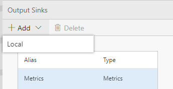
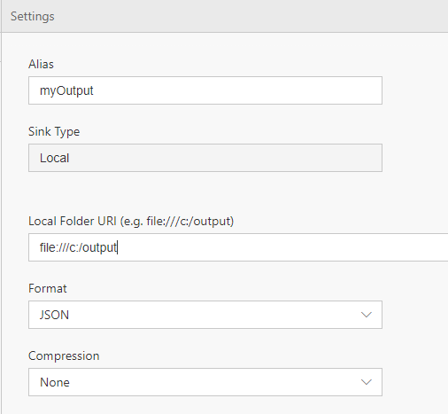
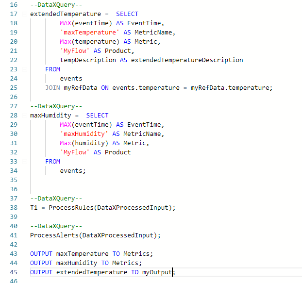

The output tab let's you configure outputs to route data to.

In this tutorial, you'll learn to:
 - Add an output location
 - Write data to this output location

# Setting up an output
 - Open your Flow
 - Open the Output Tab to configure an output and select Add 'Local' <br/>
 
   - For Alias, input "myOutput"; this is how the output will be referred to throughout the Flow, 
   - For folder, you can input '/app/myFolder'; this is the folder data will go to within the docker container
   - Format will be JSON
   - You can decide to use GZIP compression or none as well <br/>
 
 - Go back to the Query tab and input a new OUTPUT statement at the end: <br/>
    - OUTPUT extendedTemperature TO myOutput;
 
 - Click Deploy.  

You have connected the Flow to a new output.  

## View output within a docker container
You can view files within a container by using SSH to connect into the container.  This is useful to view output in case you have specified that in your flow.  
 - If you wish to view data from output
   ```
   docker exec -it dataxlocal /bin/bash
   ```
  - View the contents of a folder
    ```
    ls
    ```
  - View the contents of a file
    ```
    cat <filename>
    ```
# Viewing the data
The data is being output within the container.  In order to view it, you need to connect (bash) into the container.  See the [FAQ](FAQ).

* [Next tutorial : Output](https://github.com/Microsoft/data-accelerator/wiki/Local-Tutorial-5-Adding-SQL-to-your-flow-and-outputs-to-Metrics-dashboard)

# Other Links
* [Tutorials](Tutorials)
* [Wiki Home](Home) 