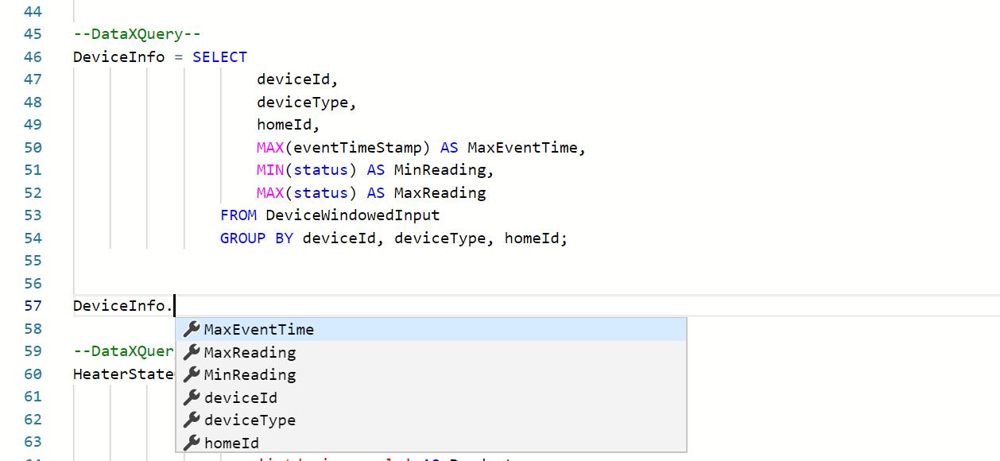
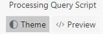

Up until now we have focused on doing processing and setting up alerts without having to write any code. That is powerful and will satisfy a bunch of scenarios. However, when the no code experience isn't sufficient to meet the needs, you can use the power of Spark SQL for more complex processing, and do so without having to learn Scala. 

In this tutorial you will learn how to:
 - Use SQL for processing data. 

# SQL query
- Create a new flow and use the schema from HomeAutomationLocal sample.

- Switch to the Query tab. This is where you can write all your SQL code. Data Accelerator supports full Spark SQL, and enhances it with few more keywords that you will learn about in the next few tutorials. For now, write a statement such as:<br/>

```sql
--DataXQuery--
T1 = SELECT * FROM DataXProcessedInput;
```

* Each query is separated by comment "--DataXQuery--" and ends with a semi-colon. 

* You can also chain queries.

```sql
--DataXQuery--
DeviceInputSummary = SELECT 
                        deviceDetails.deviceId,
                        deviceDetails.deviceType,
                        eventTimeStamp,
                        deviceDetails.homeId,
                        deviceDetails.status
                    FROM T1 
                   GROUP BY deviceId, deviceType, eventTimeStamp, homeId, status;

--DataXQuery--
DeviceInfo = SELECT 
                    deviceId,
                    deviceType,
                    homeId,
                    MAX(eventTimeStamp) AS MaxEventTime,
                    MIN(status) AS MinReading,
                    MAX(status) AS MaxReading
                FROM DeviceWindowedInputSummary
                GROUP BY deviceId, deviceType, homeId;

OUTPUT DeviceInfo TO myCosmosDB;
```

* You can use the full power of SQL and do JOINS, UNIONS, GROUP BYs, etc. Full documentation of [Spark SQL](https://spark.apache.org/sql/). Example of some of the things possible.

```sql
    --Example CAST value to another type 
    CAST(Properties.`user.isoptedin` AS Boolean) AS IsOptedIn, 
    CAST(UNIX_TIMESTAMP(_SystemProperties.`x-opt-enqueued-time`, 'EEE MMM dd HH:mm:ss z yyyy') AS TIMESTAMP)  AS     EnqueuedTimeUtc,

    --Example Formatting. In this example, phone number 4251234567 will be formatted to 425-123-4567. 
    --Note, you can specify any SQL statement 
    SUBSTRING(Properties.phoneNumber, 1, 3) + '-' 
    + SUBSTRING(Properties.phoneNumber, 4, 3) + '-' 
    + SUBSTRING(Properties.phoneNumber, 7, 4) AS PhoneNumber, 

    --Example Add a property to the bag 
    addProperty(Properties, 'datax.version', '1.2') AS Properties, 

    --Example Add a column to the output called AnswerToLife with value 42 
    42 AS AnswerToLife, 

    -- Add Tags as key-value pairs in a bag
    MAP("WindowsName", 
     CASE 
         WHEN Properties.`os.version` LIKE '10%' THEN 'Windows 10' 
         WHEN Properties.`os.version` LIKE '8%' THEN 'Windows 8'  
         WHEN Properties.`os.version` LIKE '7%' THEN 'Windows 7' 
         ELSE 'Windows Unknown'
     END,
    "StartupPerf", 
     CASE 
         WHEN Measures.`startuptime` > 10 THEN 'SLOW' 
         ELSE 'FAST'
     END) 
     AS Tags,

    -- Add Tag as column
    CASE 
        WHEN Properties.`os.version` LIKE '10%' THEN 'Windows 10' 
        WHEN Properties.`os.version` LIKE '8%' THEN 'Windows 8'  
        WHEN Properties.`os.version` LIKE '7%' THEN 'Windows 7' 
        ELSE 'Windows Unknown'
    END AS WindowsVersion,
```

* To assist you with programming and avoid typos, you will get intellisense for the columns of the table. Simply write the name of the table and dot and hit Ctrl+Space to invoke intellisense. For those who have worked with long SQL queries and tables, will appreciate that this will save hours of frustration with typos!
<br/>

* Go ahead! Try out some queries and send the data sets to different sinks. You are on your way to create some powerful stream processing using SQL skills!

# Exploring the Query Editor features
 - You can set the theme to the dark theme, or see the code preview to debug issues<br/>
 
 - The Run button lets you query incoming data in line and get results instantly! However, this functionality is only available in a Azure deployment.  See the [Cloud SQL Tutorial](https://github.com/Microsoft/data-accelerator/wiki/Live-query) to learn more.

You can now continue to iterate on your query to add more logic and validate the changes on the Metrics dashboard.

* [Next tutorial : Create Metric](https://github.com/Microsoft/data-accelerator/wiki/Local-create-metric)

# Other Links
* [Tutorials](Tutorials)
* [Wiki Home](Home) 