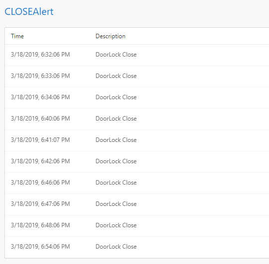

In the previous example we walked through how to set up a simple alert. At times, there is a need for setting up an alert, not based on the current value, but an aggregate value (such as min, max, average, etc.). In this tutorial you will learn how to set up an alert for aggregated values, without writing any code. 

# Steps to follow
* Open your flow 
* To make the data more interesting, we will use the event schema below. This is the same schema that is also used by the HomeAutomationLocal sample. Copy this schema and paste it in your flow, and delete any existing queries in the Query tab.

```javascript
{
  "type": "struct",
  "fields": [
    {
      "name": "deviceDetails",
      "type": {
        "type": "struct",
        "fields": [
          {
            "name": "deviceId",
            "type": "long",
            "nullable": false,
            "metadata": {
              "allowedValues": [
                1,
                2,
                3,
                4,
                5,
                6
              ]
            }
          },
          {
            "name": "deviceType",
            "type": "string",
            "nullable": false,
            "metadata": {
              "allowedValues": [
                "DoorLock",
                "WindowLock",
                "Heating"
              ]
            }
          },
          {
            "name": "eventTime",
            "type": "long",
            "nullable": false,
            "metadata": {
              "useCurrentTimeMillis": true
            }
          },
          {
            "name": "homeId",
            "type": "long",
            "nullable": false,
            "metadata": {
              "allowedValues": [
                32,
                150,
                25,
                81
              ]
            }
          },
          {
            "name": "status",
            "type": "long",
            "nullable": false,
            "metadata": {
              "allowedValues": [
                0,
                1
              ]
            }
          }
        ]
      },
      "nullable": false,
      "metadata": {}
    }
  ]
}
```

* Switch to Rules tab and click on "+ Add | Tag Rule" button: <br/>
 <br/>

* With Sub type set to 'Aggregate' and Target table set to 'DataXProcessedInput' (which is the default input table), provide a description of the alert and add a Tag value. Note, you can also set up regular filters on dimensions that aren't aggregated as well by selecting (none). Any message/event satisfying the alert condition will be tagged with the value provided for Tag. <br/>

 <br/>

* Use the intuitive UI to set up the condition for firing an alert as shown above. For this example, the data ingested is home automation data. We want to be alerted anytime door for house number 150 is locked. Note, deviceDetails.status of 1 means locked, 0 means unlocked.  

* Set 'Do you want to be alerted?' to Yes, and choose Output sink as 'Metrics'. This is the default output sink. In the next few tutorials we will walk through how to set up other outputs. 

* Click "Deploy" button. That's it! You have now created an aggregated alert, which will be fired each time the condition is met. <br/>
 <br/>

# View Metrics
Now, switch over to the Metrics tab and notice that there is a new table for 'CLOSEAlert', which will be fired each time the door of house number 150 is locked.<br/>
 

* [Next tutorial : Output](https://github.com/Microsoft/data-accelerator/wiki/Local-Tutorial-Outputs-to-disk)

# Other Links
* [Tutorials](Tutorials)
* [Wiki Home](Home) 