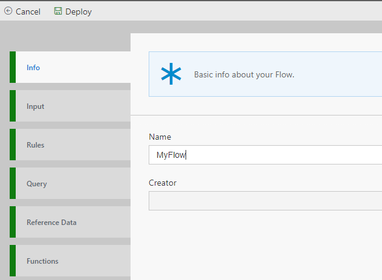

Once you have completed the [installing locally](https://github.com/Microsoft/data-accelerator/wiki/Local-mode-with-Docker), you are ready to start setting up a pipeline locally.

In this tutorial, you'll learn to:
 - Create a Flow
 - View the Metrics dashboard

# Creating a Flow
 - Ensure the http://localhost:49080 site is opened to the DataX Portal
 - Click on "New" on the Flows tab, this will set up a basic flow: 
 

 - The Info tab has the Flow name.  We'll need that in the next step.

 - Click Deploy to start the flow.  That's it! 

# View the metrics
 - You can open the metrics tab; this tab will help visualize your data and validate query changes.
	

You have now created a pipeline with visualization of the incoming data.

# So what is really happening? 
Data Accelerator is simulating events/messages which are flowing through the Data Accelerator's engine (which currently is not doing any processing on the events, since we haven't specified any yet!), and the stats are being plotted on the Metrics dashboard. If you click on the 'Flows' tab, and open up 'MyFlow' and look at the 'Input' tab, you will notice the schema in JSON format. That is the format of the events being simulated. In future tutorials you will learn how to change the schema of the events being generated, and of course how to add processing to your pipeline.

* [Next tutorial : Alerts](https://github.com/Microsoft/data-accelerator/wiki/Local-Tutorial-Add-an-Alert/)

# Other Links
* [Tutorials](Tutorials)
* [Wiki Home](Home) 