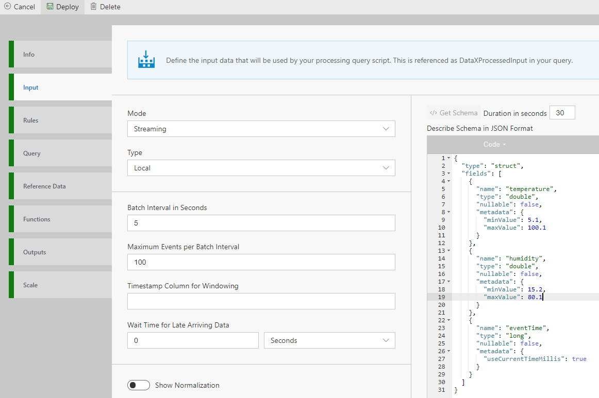

Data Accelerator allows you to simulate the data of your desired schema, so you can try out your scenarios locally. This tutorial walks you through how you can customize the schema generated by the data simulator, so you can simulate your data pipeline.
 
# Update the Schema of generated data

 - Open existing flow (e.g. BasicLocal sample)
 - Go to Input tab
 - In the schema section, edit the text.  To add a value, add the following:
    - name : name of the column
    - type : can be double, int, string, etc
    - nullable : if value can be null, true or false,
    - Metadata :  
      - minValue : for decimals, floor value for which the generated data will stay above,
      - maxValue : for decimals, ceiling value for which the generated data will stay under

NOTE: For double datatype, value should be double value like 15.1. Also due to issue with JSON editor which rounds off 0s after decimal, make sure the value after decimal is > 0. ie. 15.0 won't work, make it 15.1.
	

 - Click Deploy
	
You now have the pipeline running with your custom data! And you are able to see basic stats on the Metrics dashboard. You can add Rules, Alerts, SQL processing, etc. to customize the processing of your data.  

# Data generation hints

Following data generation hints are supported (in local mode) based on data type via metadata tag:

Numbers (int, long, float, double)

```javascript
  "metadata": {
        "minValue": 5.1,
        "maxValue": 100.1
      }

  "metadata": {
        "allowedValues": [1,2,3,5,7]
      }


// this is only for long type. This will generate timestamp value in milliseconds
  "metadata": {
        "useCurrentTimeMillis": true
      }
```

String , Array, Map (control the length of data generated)
```javascript
 "metadata": {
        "maxLength": 9
      }
```
Apart from these data types, boolean and struct data types are also supported in local mode. Example:

```javascript
{
  "type": "struct",
  "fields": [
    {
      "name": "deviceDetails",
      "type": {
        "type": "struct",
        "fields": [
          {
            "name": "deviceId",
            "type": "long",
            "nullable": false,
            "metadata": {
              "allowedValues": [
                1,
                2,
                3,
                4,
                5,
                6
              ]
            }
          },
          {
            "name": "deviceType",
            "type": "string",
            "nullable": false,
            "metadata": {
              "allowedValues": [
                "DoorLock",
                "WindowLock",
                "Heating"
              ]
            }
          },
          {
            "name": "eventTime",
            "type": "long",
            "nullable": false,
            "metadata": {
              "useCurrentTimeMillis": true
            }
          },
          {
            "name": "homeId",
            "type": "long",
            "nullable": false,
            "metadata": {
              "allowedValues": [
                32,
                150,
                25,
                81
              ]
            }
          },
          {
            "name": "status",
            "type": "long",
            "nullable": false,
            "metadata": {
              "allowedValues": [
                0,
                1
              ]
            }
          }
        ]
      },
      "nullable": false,
      "metadata": {}
    }
  ]
}
```

* [Next Tutorial : Scaling the host](https://github.com/Microsoft/data-accelerator/wiki/Local-Tutorial-Scaling-the-docker-host)

# Links
* [Tutorials](Tutorials)
* [Wiki Home](Home) 