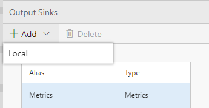
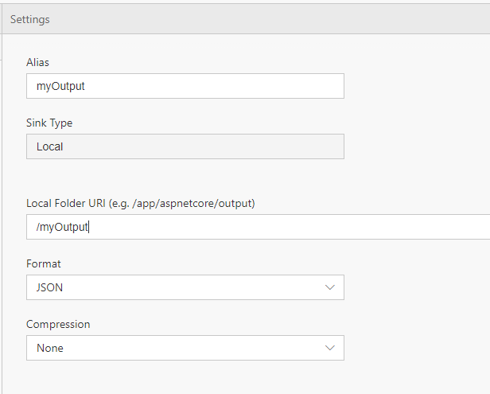

The output tab let's you configure outputs to route data to. Since we are in local mode, we will see how to output the data to the local file system. In the cloud mode (i.e. once Data Accelerator is deployed to Azure), you would be able to output data to various other sinks such as Azure blobs, CosmosDB, etc. 

In this tutorial, you'll learn to:
 - Add an output location
 - Write data to this output location

# Setting up an output
 - Open your Flow
 - Open the Output Tab to configure an output and select Add 'Local' <br/>
 <br/>
 - For Alias, input "myOutput"; this is how the output will be referred to throughout the Flow, 
 - For folder, you can input '/myOutput'; this is the folder data will go to within the docker container
 - Format will be JSON
 - You can decide to use GZIP compression or none as well <br/>
 <br/>
 - Go back to the Query tab and input a new OUTPUT statement at the end to output to local filesystem: <br/>
```sql 
--DataXQuery--
events = SELECT MAX(temperature) as maxTemp
	 FROM 
	 DataXProcessedInput;

maxTemperature = CreateMetric(events, maxTemp);

OUTPUT maxTemperature TO Metrics;
OUTPUT events TO myOutput;
```

Query window will look like below:
 <br/>
 - Click Deploy.  

You have connected the Flow to a new output.  

## View output within a docker container
You can view files within a container by statrting a bash session inside the container.  This is useful to view output in case you have that specified in your flow. You can cd into the folder you specified when adding a local output location, say, Local Folder URI (e.g. /app/aspnetcore/output)
 - If you wish to view data from output
   ```
   docker exec -it dataxlocal /bin/bash
   ```
  - View the contents of a folder
    ```
    ls
    ```
  - Navigate to a particular folder. Inside it, you will notice that the data is stored in folders based on YYYY/MM/dd/hh/mm/_batch-interval_ (UTC time) and contains a single file per output. Example: cd /myOutput/2019/04/23/45/234800
    ```
    cd <folder name>
    ```
  - View the contents of a file. Example: cat part-0.json
    ```
    cat <filename>
    ```

* [Next tutorial : Add Simple Tags](https://github.com/Microsoft/data-accelerator/wiki/Local-Tutorial-Tag-Rules-output-to-local-file)

# Other Links
* [Tutorials](Tutorials)
* [Wiki Home](Home) 