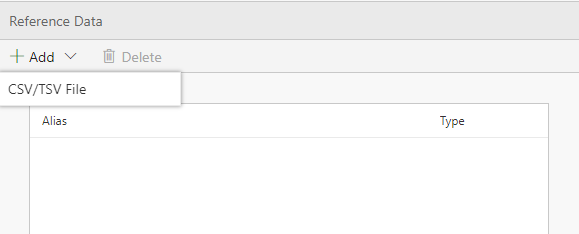
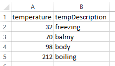
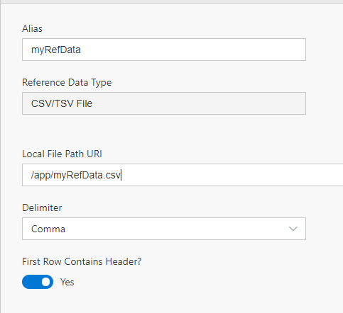
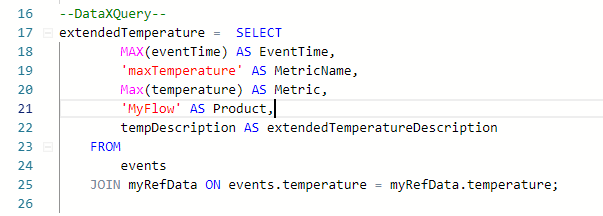

The Reference tab is where you can add static data to join with your streaming data.

In this tutorial, you'll learn to:
 - Add Reference data
 - Use the Editor features to join to your Reference Data

# Adding Reference Data
 - Open your Flow and go to the Reference tab
 - Add a new CSV/TSV file <br/>

 - Given a csv file that looks as such located in /app/myRefData.csv in the container. (See [FAQ](https://github.com/Microsoft/data-accelerator/wiki/FAQ#copy-files-into-or-from-a-docker-container) how to upload a file to your docker.)<br/>

 - Set up your CSV by setting up:
    - Alias: this will be how to use the reference data in your query, for example: myRefData
    - Path: where to load the reference data from, for example '/app/myRefData.csv';
    - Delimiter: data can be comma or tab limited
    - Header: if your data has a header row<br/>

 - Open the Query tab of your flow
 - You can now join your streaming data to the reference data by doing a JOIN: <br/>
```sql
    JOIN myRefData ON myRefData.temperature;
```


 - Add an output statement to the code: <br/>
```sql
    OUTPUT extendedTemperature TO myOutput;
```
 - Click Deploy

Your data now has reference data joined to it.  You can view the results by looking at the local file output as described in this [tutorial](https://github.com/Microsoft/data-accelerator/wiki/Local-Tutorial-Outputs-to-disk).  

* [Next tutorial : Windowing](https://github.com/Microsoft/data-accelerator/wiki/Windowing-functions)

# Other Links
* [Tutorials](Tutorials)
* [Wiki Home](Home) 