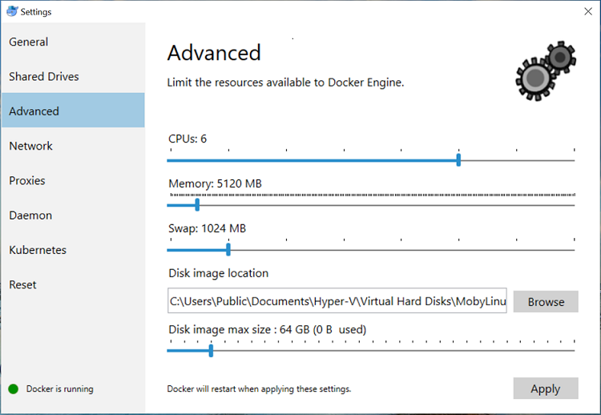

# For best performance
For best performance, it is recommended to use the following settings for docker:
 - CPU: 6
 - Memory: 5 gigs or more

Also, please run only 1 job at a time in local mode. You can start and stop jobs using the 'Jobs' tab.

# Links
* [Tutorials](Tutorials)
* [Wiki Home](Home) 