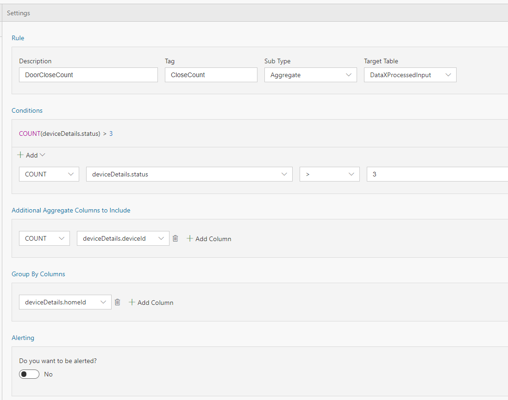

In the previous tutorial we saw how to Tag streaming data when certain conditions are met. In this tutorial you will learn how you can set up rules to tag the data based on aggregate values without writing any code. 

# Steps to follow 
* Open your flow 
* Switch to Rules tab and click on "+ Add | Tag Rule" button: <br/>
 <br/>
* With Sub type set to 'Aggregate' and Target table set to 'DataXProcessedInput' (which is the default input table), provide a description of the rule and add a Tag value. Any message/event satisfying the condition will be tagged with the value provided for Tag. <br/>
 <br/>
* Use the intuitive UI to set up the condition for tagging as shown above. 
- In the Query tab, call ProcessAggregateRules() API and route the data to your desired output sink.

```sql
	--DataXQuery--<br/>
	T2 = ProcessAggregateRules(DataXProcessedInput);

        OUTPUT T2 TO myOutput;
```

 - Click Deploy

T2 will now contain the DataXProcessedInput data, along with tags from the rule set in this Flow.

* Click "Deploy" button. That's it! You have now created an aggregate rule for tagging that will be output to disk.  <br/>
 

* [Next tutorial : Reference Data](https://github.com/Microsoft/data-accelerator/wiki/Local-Tutorial-Adding-SQL-to-your-flow-and-outputs-to-Metrics-dashboard)

# Other Links
* [Tutorials](Tutorials)
* [Wiki Home](Home) 