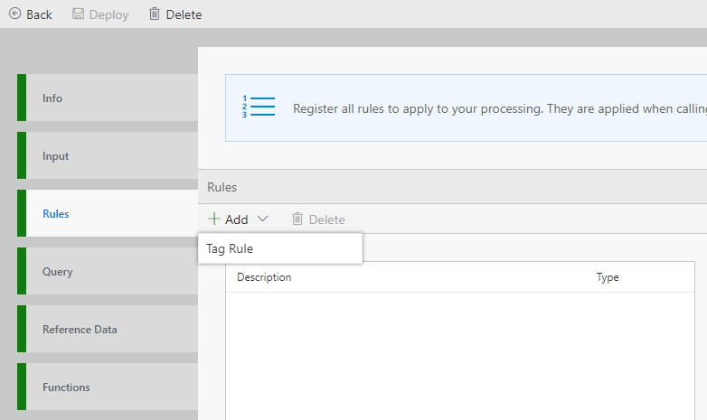

For various kinds of analysis, business insights, technical insights, cohort analysis, etc. it is important to analyze and "Tag" the streaming data. Downstream processing can then take advantage of these tags for immediate action or down the road insights. 

In this tutorial, you'll learn to:
 - Create a tag rule without writing code

# Creating a rule 
 - Create New Flow
 - Go to Rules tab, and click Add a "Tag Rule". <br/>

 - Set a Description for the rule and a tag to describe the rule.  This will be additional metadata being added to rows of the input table DataXProcessInput.
 - In conditions, select the column of data to monitor and set the condition to measure against.  i.e. select 'temperature' in the column, select '>' and 60.  This would trigger the rule when the temperature value is above 60.

 - In the Query tab, call ProcessRules() API and route the data to your desired output sink:
```sql
	--DataXQuery--
	T1 = ProcessRules(DataXProcessedInput);

        OUTPUT T1 TO myOutput;
```
 
 - Click Deploy

T1 will now contain the DataXProcessedInput data, along with tags from the rules set in this Flow.  You can view the data flowing in the location defined in the [previous tutorial](https://github.com/Microsoft/data-accelerator/wiki/Local-Tutorial-Outputs-to-disk).

* [Next tutorial : Aggregate Tags](https://github.com/Microsoft/data-accelerator/wiki/Local-Tutorial-Tag-Aggregate-to-metrics)

# Other Links
* [Tutorials](Tutorials)
* [Wiki Home](Home) 