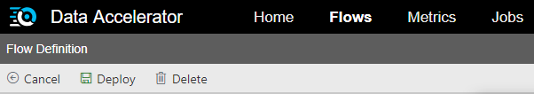

Metrics dashboard allows you to create your own metrics. This is useful when you want to debug or simply see the shape of data. In this tutorial you will learn how to create your own metric that will show up on the Metrics dashboard. 

# Steps to follow
- Open or create a flow and use schema from HomeAutomationLocal sample.

- Switch to the Query tab. Let's say we wanted to plot a chart for the count of devices sending data for house number 150. To do so, first, write a query to find the device count for house 150. 

```sql
--DataXQuery--
T1 = Select COUNT(deviceDetails.deviceId) AS deviceCount
    FROM DataXProcessedInput
    WHERE deviceDetails.homeId=150;
```

- Now use **CreateMetric()** API to create the metric. This API takes as input the table and column that has the information to plot on the Metrics dashboard. It returns a table which you want to output to the Metrics dashboard.

```sql
DeviceCount = CreateMetrics(T1, deviceCount);

OUTPUT DeviceCount TO Metrics;
``` 

- The full code for this, looks like below:<br/>
 <br/>

- Click "Deploy" button. That's it! You have now created a chart called 'DeviceCount' that will show up on Metrics dashboard. <br/>
 

# View Metrics
- Switch to the Metrics tab and notice DeviceCount chart.
 <br/>

# Note
- You can also OUTPUT multiple Tables to Metrics as shown below (from the home automation sample). This will create a multi-line chart.
Code snippet:
```sql
OUTPUT GarageDoorStatusOneForLocked, GarageDoorSlidingMinutesOpenedIn5minutes, GarageMinutesOpenedInAnHour TO Metrics;
```
 <br/>

* [Next tutorial : Spark Logs](https://github.com/Microsoft/data-accelerator/wiki/Local-Tutorial-Debugging-using-Spark-logs)

# Links
* [Tutorials](Tutorials)
* [Wiki Home](Home)