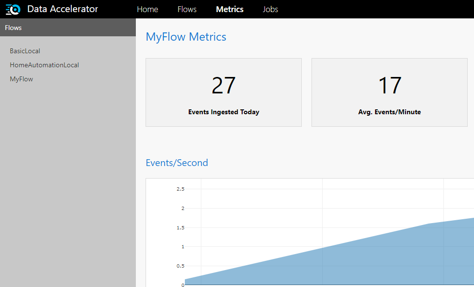

Once you have completed the [local deployment](https://github.com/Microsoft/data-accelerator/wiki/Local-mode-with-Docker), and open the Data Accelerator portal, you will notice there are 2 samples under the 'Flows' tab. In this tutorial you will learn how to run the sample and in the future tutorials we will walk through the different features that are used by these samples. 

# Steps to follow
1. Open the Data Accelerator portal at http://localhost:49080/home
2. Switch to the 'Flows' tab. You will notice 2 Flows 
3. Click on any one of them (say, BasicLocal)
4. Switch to Query tab and make an edit (example: enter a space in the editor). This will enable the Deploy button 
5. Hit the Deploy button. That's it! The data pipeline is setup and data is flowing through Data Accelerator, being processed and outputted to the Metrics tab.

# View the output
1. Switch over to the Metrics tab
2. After about a minute, you should see basic stats (such as number of events per minute, and per second) flowing through the pipeline, along with any custom charts that are outputted by the flow.   
	 

# So what is really happening? 
Data Accelerator is simulating events/messages which are flowing through the Data Accelerator's engine, and the stats are being plotted on the Metrics dashboard. If you click on the 'Flows' tab, and open up the flow and look at the 'Input' tab, you will notice the schema in JSON format. That is the format of the events being simulated. And the 'Query' tab shows the processing being run on the data. 'Rules' tab shows the rules and alerts set up (you will learn more about these in the future tutorials, and how to set up your own data pipeline with custom processing.). 

* [Next tutorial : Create your first flow](https://github.com/Microsoft/data-accelerator/wiki/Local-Tutorial-Creating-your-first-Flow-in-local-mode)

# Other Links
* [Tutorials](Tutorials)
* [Wiki Home](Home) 