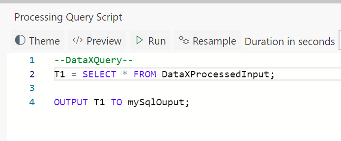

In this tutorial you will learn how to ouput the dataset defined in code to a Azure SQL Database sink using the OUTPUT keyword. 

# Steps to follow
* Create a flow using [first tutorial to create a pipeline in 5 minutes](Creating-your-first-pipeline-in-5-minutes!)

* Open the Output tab and add a new output sink. Select Azure SQL Database 
 
* Configure the Azure SQL Database, by specifying the alias, JDBC connection string and write mode. In this example we choose Append mode  
 
* Switch to the Query tab and at the end add following line using the OUTPUT keyword. 
OUTPUT T1 TO mySqlOutput;  
 
* Create a table in the Azure SQL Database named taggedResult with the schema of the data you want to write
* Click "Deploy" button. That's it!  
 

**Notes**
- You can optionally use bulk insert to insert data to SQL database. Writes will be faster, however there are few restrictions that you need to be aware off
  - The data types of the data being written need to exactly match that in SQL table
  - The order (ordinal) of columns in data being written need to exactly match that in SQL table

- Apart from Azure SQL Database, you can also output to Azure SQL Data Warehouse by specifying its connection information in the same way in the Azure SQL Database output settings page. 

# View Data
Now, switch over to the output sink, and notice the data flowing to Azure SQL Database. 

# Links
* [Tutorials](Tutorials)
* [Wiki Home](Home) 

