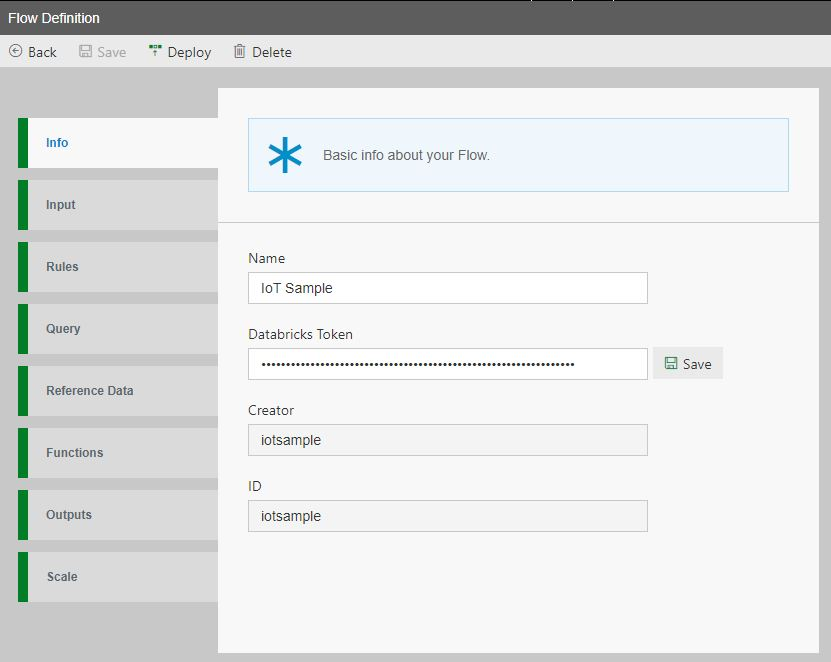

Open Data Accelerator Portal via https://_name_.azurewebsites.net (Url available via the Azure Portal under the deployed App Service. To find this, go to App Services in https://portal.azure.com, click on the app service called "dx*", and open the URL). Click on the Flows TAB to see the list of sample flows and select any sample flow

### Set Databricks Token
On the Info TAB, you will notice a 'Databricks Token' textbox which is specific for databricks environment and does not show up on HDInsight environment. Enter your databricks token generated using [these steps](#generate-databricks-token) here and click the Save button.

### Set Scale
Switch to Scale TAB. Here you can enable/disable Autoscale and also set number of workers for each flow. Once deployed, each flow will run on its own databricks cluster. If Autoscale is enabled then the cluster will autoscale between the min and max no. of workers (as specified in the flow) depending upon the cluster load. If autoscale is disabled then the cluster will continue to use a constant number of workers irrespective of the cluster load.

Click the deploy button and this will start the job on Databricks. You can view the charts on the Metrics TAB of Data Accelerator Portal.