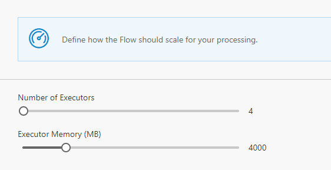

The default deployment of Data Accelerator provisions basic resources for Spark and Service fabric. In this tutorial you will learn how to scale up the capacity.

# Steps to follow
The Data Accelerator portal itself has a Scale tab that you can use to alter the number of cores and memory used by each executor. these are set to smart defaults, so you don't need to tweak this by default and works well for the sample input and rate. However, for higher volumes and rate of data, it may be required to increase the cores and memory. You can do so by sliding the scale.

After you have made the changes, be sure to hit 'Deploy' for the changes to take effect.  

This will only let you scale up to the number of cores and memory available for these resources. To go even higher, you will need to do this via the Azure portal. 

# Steps to scale up via Azure Portal

- Login to [Azure portal](https://portal.azure.com)

- In your subscription go to the HD Insights cluster resource.
- Under Settings, select ‘Cluster Size’
- Change ‘Number of Worker Nodes’ from 4 to the desired number of nodes.
- Click Save.

Note: At the point where sufficient number of cores are not available to scale out the cluster further then a support request needs to be created to increase the compute (cores) limit for the subscription at this [link](https://ms.portal.azure.com/#blade/Microsoft_Azure_Support/HelpAndSupportBlade/overview)

If you are using Metrics dashboard for high volume of data, then you will need to up the scale of Service Fabric cluster via Azure portal using similar steps above.

# Deployment
In [deployment tutorial](Arm-Parameters) you will learn how to customize the deployment so you don't start with the default settings, but are able to control among other things the number of cores, memory, VM type, region of resources provisioned by using the deployment script parameters. 

# Links
* [Tutorials](Tutorials)
* [Wiki Home](Home) 