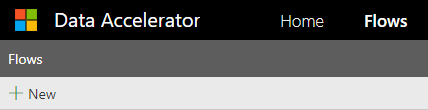
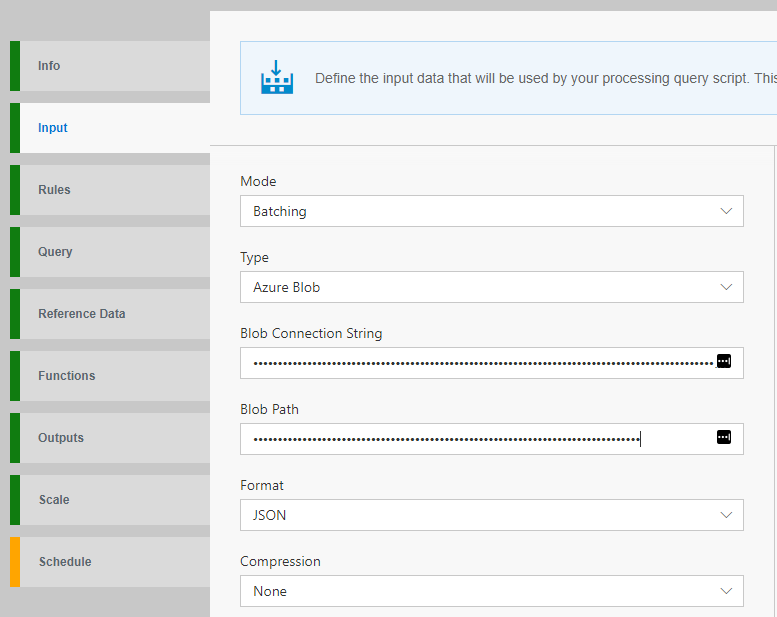
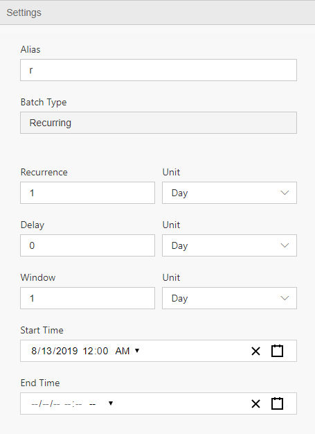
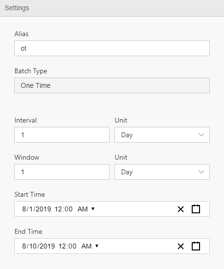

In this tutorial you will learn how to:
* Create a new Flow for batching
* Configure input source of data (Supported today: blob)
* Inspect schema of incoming data
* Schedule jobs
* Save

# Steps to follow
* Open Data Accelerator portal and go to the Flows tab

* Click on "New" on the Flows tab, this will create a new Flow:  
 

* Switch to the Input tab and select Batching for Mode and Azure Blob for Type. Data Accelerator currently supports only Blob for Batching

* Provide the following information of your input Azure blob
  - The Connection string
  - The Blob Path. This should be a wasbs URL format. If your path contains date and time, you can use DateTime pattern with curly brackets '{' and '}'  
      e.g. wasbs://<container_name>@<storage_account_name>.blob.core.windows.net/<folder_name>/{yyyy-MM-dd}. 
  

* Click "GetSchema" button. This reads the blobs from the given path and infer the schema.  

* Switch to the schedule tab and click Add button. There are two types of scheduling.
   - Recurring
      This creates a job based on the given recurrence. e.g. If Recurrence is 1 day, it will create one job per day. 
  

   - One Time
      This creates all jobs for the given the date range at once (between the start time and the end time). And once all jobs are scheduled, the schedule will be disabled and read-only. 
 

  - **Recurrence**:
    It specifies an interval between jobs. The available values are day, hour and minute.  

  - **Delay**:
    It specifies an offset for a job. The offset is negative so an actual start time will be calculated by subtracting offset from the original start time. The available values are day, hour and minute.

  - **Window**:
    It specifies how much a job will look back. The available values are day, hour and minute. 

* Click "Save" button to save the Flow. Once it's saved, the jobs will be created and be running by the scheduler. Currently the interval of the scheduler is 1 hour.

* For details on other tabs, please check this https://github.com/Microsoft/data-accelerator/wiki/Creating-your-first-pipeline-in-5-minutes!