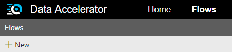

In this tutorial you will learn how to:
* Create a new Flow for batching
* Configure input source of data (Supported today: blob)
* Inspect schema of incoming data
* Schedule jobs
* Save

# Steps to follow
* Open Data Accelerator portal and go to the Flows tab

* Click on "New" on the Flows tab, this will create a new Flow:  
 

* Switch to the Input tab and select Batching for Mode and Azure Blob for Type. Data Accelerator currently supports only Blob for Batching

* Provide the following information of the blob you want to use as an input
  - The Connection string
  - The Blob Path. This should be a wasbs URL format. If your path contains date and time, you can use DateTime pattern with curly brackets '{' and '}'  
      e.g. wasbs://<container_name>@<storage_account_name>.blob.core.windows.net/<folder_name>/{yyyy-MM-dd}

_Input type:Blob_ 
   