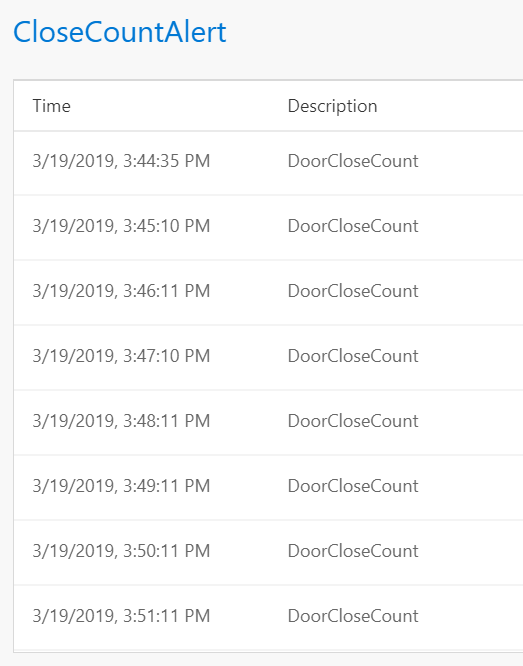

In the previous example we walked through how to set up a simple alert. At times, there is a need for setting up an alert, not based on the current value, but an aggregate value (such as min, max, average, etc.). In this tutorial you will learn how to set up an alert for aggregated values, without writing any code. 

# Steps to follow
* Create a flow using [first tutorial to create a pipeline in 5 minutes](Creating-your-first-pipeline-in-5-minutes!). Note that in the Input tab, our batch interval defaults to 30 seconds i.e. events will be processed in intervals of 30 seconds.

* Switch to Rules tab and click on "+ Add | Tag Rule" button:  
  

* With Sub type set to 'Aggregate' and Target table set to 'DataXProcessedInput' (which is the default input table), provide a description of the alert and add a Tag value. Any message/event satisfying the alert condition will be tagged with the value provided for Tag.  

  

* Use the UI to set up the condition for firing an alert as shown above. For this example, if a lock is closed more than 3 times for a house then an alert is fired. This is done by selecting **COUNT(deviceDetails.status) > 3**. In addition to this, you can specify additional aggregations to perform, such as COUNT(deviceDetails.deviceId). Finally, specify the columns to GROUP BY. We have chosen to group by homeId. Note, deviceDetails.status of 1 means locked, 0 means unlocked.  

* Set 'Do you want to be alerted?' to Yes, and choose Output sink as 'Metrics'. This is the default output sink. In future tutorials we will walkthrough how to set up other outputs. 

* Click "Deploy" button. That's it! You have now created an alert, which will be fired each time the condition is met i.e. door of house number 150 is locked!  
 

# View Metrics
Now, switch over to the Metrics tab and notice that there is a new table for 'CLOSEAlert', which will be fired each time the door of house number 150 is locked. 
 

# Links
* [Tutorials](Tutorials)
* [Wiki Home](Home) 