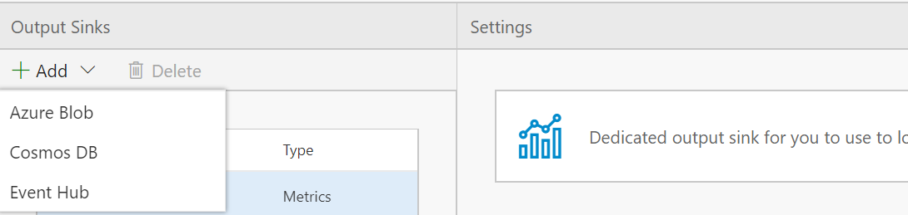
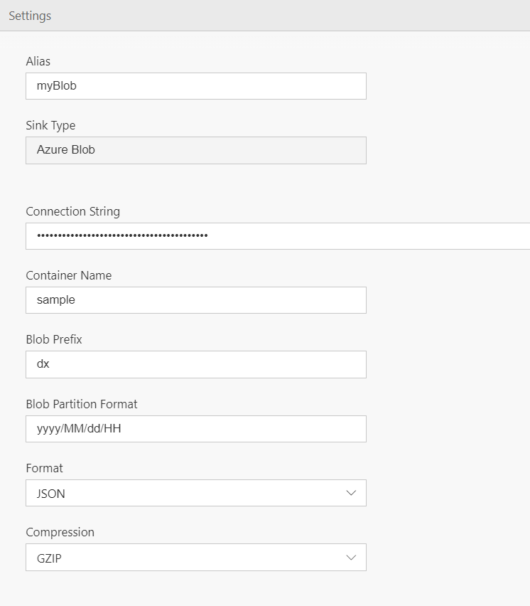
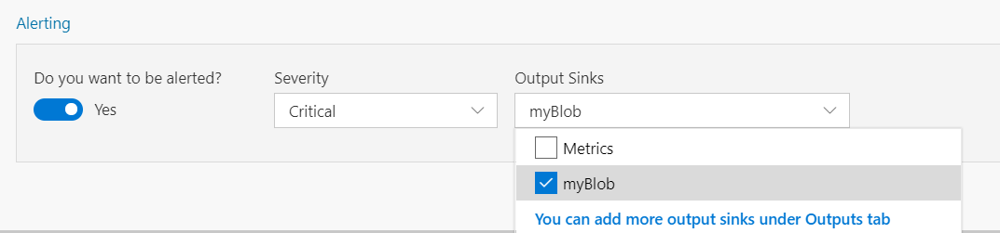

The output tab let's you configure outputs to route data to.

In this tutorial, you'll learn to:
 - Add an output location
 - Write data to this output location

# Steps to follow
* In the [previous tutorial](set-up-simple-alert) we saw how to set up an alert and send it to Metrics tab. Open this Flow.
 
- Click the Output tab to open it and select "+ Add | Azure blob" from the drop down. Note Data Accelerator supports sending data to Cosmos DB, Azure blob, etc. and more sinks can be added. 
 

 - For Alias, write "myBlob"; this is how the blob will be referred to throughout the Flow. 
 
 
   - The following information will come from the Azure Portal:
   - The connection string will come from the Portal
   - Container name will be where the data will be going
   - Blob prefix and partition format will set up how to file the files in the blob
   - You can decide to use GZIP compression or none as well

- Go back to the Rules tab and select "myBlob" from the alert drop down of the rules you have created  
 

- Click Deploy. That's it! You have now added a new output to your pipeline.   
 

# View Data
Now, switch over to the output location and view the output data flowing to that location. 

# Links
* [Tutorials](Tutorials)
* [Wiki Home](Home) 
