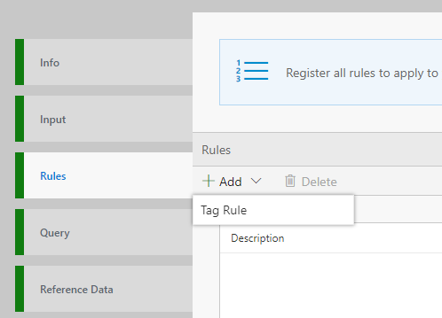
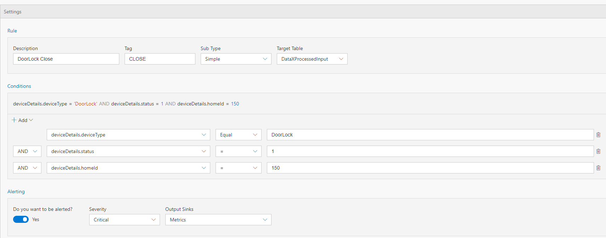
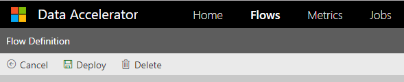
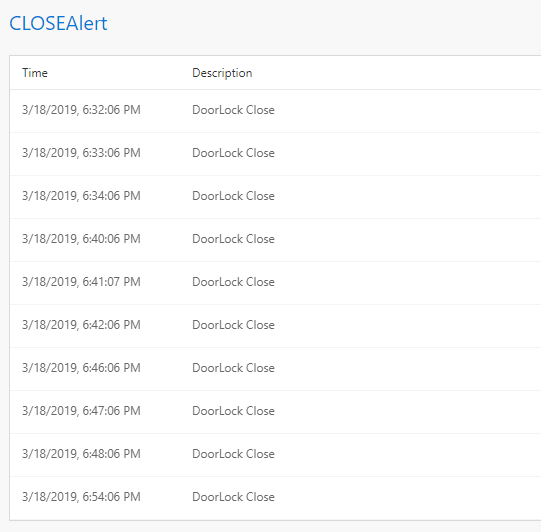

In several cases, you want to be alerted when certain condition is met in the data being ingested. In this tutorial you will learn how to set up an alert in minutes without writing any code.  

# Steps to follow
* Create a flow using [first tutorial to create a pipeline in 5 minutes](Creating-your-first-pipeline-in-5-minutes!)

* Switch to Rules tab and click on "+ Add | Tag Rule" button:  
  

* With Sub type set to 'Simple' and Target table set to 'DataXProcessedInput' (which is the default input table), provide a description of the alert and add a Tag value. Any message/event satisfying the alert condition will be tagged with the value provided for Tag. (We will walk through Aggregate type in the next tutorial) 

  

* Use the intuitive UI to set up the condition for firing an alert as shown above. For this example, the data ingested is home automation data. We want to be alerted anytime door for house number 150 is locked. Note, deviceDetails.status of 1 means locked, 0 means unlocked.  

* Set 'Do you want to be alerted?' to Yes, and choose Output sink as 'Metrics'. This is the default output sink. In future tutorials we will walkthrough how to set up other outputs. 

* Click "Deploy" button. That's it! You have now created an alert, which will be fired each time the condition is met i.e. door of house number 150 is locked!  
 

# View Metrics
Now, switch over to the Metrics tab and notice that there is a new table for 'CLOSEAlert', which will be fired each time the door of house number 150 is locked. 
 

# Links
* [Tutorials](Tutorials)
* [Wiki Home](Home) 
