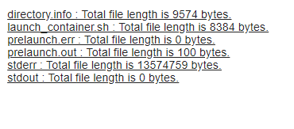

If you run into issues with your job, you will want to dig into the job logs to determine the cause. In this tutorial you will learn how.

# Getting to the logs

- You can manage your jobs using the 'Jobs' page on the Data Accelerator portal. Here you will see all the jobs that are running, or not. 
 

- To start or stop the job, you can use the play and stop buttons.

- To access the logs for running or recently terminated jobs, click on the logs link. you will then be prompted for username and password for HDInisghts cluster, which is stored in KeyVault.

- To get the username and password:

_If you are admin of the subscription where Data Accelerator is deployed:_
- Sign-in to the [Azure portal](https://portal.azure.com), go to the resources of the subscription where Data Accelerator has been deployed and open the KeyVault resource called kvServices*, and click on Secrets. If you get a message saying 'You are unauthorized to view the contents' then you need to give yourself access to the Keyvault.   
 

- To give access to the KeyVault, click on Access Policies 
 

- Click on '+Add new' 
 

- Fill in yourself as the Access Principal and select Get and List for Secret permissions.  
 

- Now, Save your changes and click on the Secrets for the Keyvault. This time you should be able to see all the secrets. Click on secret called configgen-livyconnectionstring-*

- Click on current version and then on 'Show secret value', which will show you the endpoint, username and password. Use the username and password and login to the HDInisghts cluster.

_If you do not have access to the subscription where Data Accelerator is deployed:_

- Ask you admin for the username and password of the HDInisghts cluster (your admin will need to follow the steps above), or ask the admin to give you permission to the subscription (or the Keyvault) and you can follow the steps above.

- Once you login, you will see the error for your job along with logs table at the bottom. Click on the logs link to see the detailed logs of the job. 

- You can also check out all the jobs in the cluster by clicking on 'Applications' on the left menu or filter the jobs to running, killed, etc.  
 

# Examining the logs

- Opening log of a job that is finished, you may see message like this on the top of the log file. By default, you only see 4K bytes of the log. Click on the link provided to see the full logs.  
 

- Opening log of a running job, you may see this. Click on stderr to see the logs:  
 

- For a running job you can also click on Application Master, then click on Streaming tab to see the streaming job execution details. 
  
  

- By default, you will only see 4096 bytes. You can click on the link to see the full logs (however, it can be pretty huge and take a long time to load). Alternatively, notice that the URL ends with /livy/stderr/?start=-4096. You can change that to /livy/stderr/?start=-409600 to see more of the log, and you can continue to tweak the number if it helps to see more of the log to help you narrow down the issue. 

# Conclusion
With Data Accelerator's Jobs page, you can manage the job, and when you need to dig in to the logs to narrow down an issue, you can do so by clicking on the logs link and logging in to the HDInisghts cluster. 

# Links
* [Tutorials](Tutorials)
* [Wiki Home](Home) 

