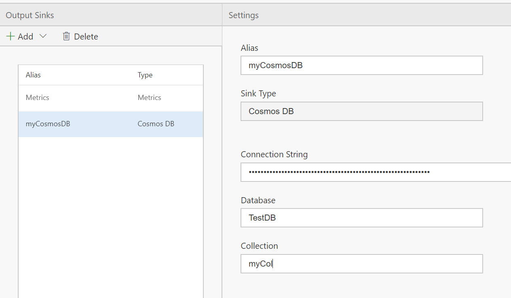
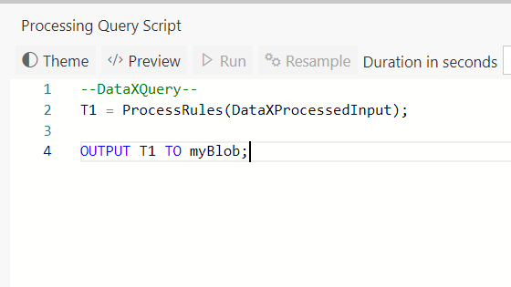

In a [previous tutorial](Set-up-new-outputs) we had seen how to set up a new output sink and direct alerts to that output sink. In this tutorial you will learn how to direct any dataset defined in code to a sink using the OUTPUT keyword. 

# Steps to follow
* Open the flow created in the [Tagging tutorial](Tagging-simple-rules)

* Open the Output tab and add a new output sink. In this example, we have chosen to configure a CosmosDB, and the alias used is myCosmosDB.  
 

* Switch to the Query tab and at the end add following line using the OUTPUT keyword.Doing so will start flowing the data set to the new output sink!  

OUTPUT T1 TO myCosmosDB;  
 

**Notes**
- If you had multiple data sets (T1, T2, ...), you could output all of them to the same output, like so: 
OUTPUT T1, T2, T3 TO myCosmosDB;
- Similarly, if you wish to output a single data set to multiple output sinks, you can do that too, like so: 
OUTPUT T1 TO myCosmosDB, myBlob;

* Click "Deploy" button. That's it! You have now created a rule for tagging. Each time a door is locked, the message will contain the Tag "DoorLocked".  
 

# View Data
Now, switch over to the output sink, and notice the data flowing in with the Tags. 

# Links
* [Tutorials](Tutorials)
* [Wiki Home](Home) 

