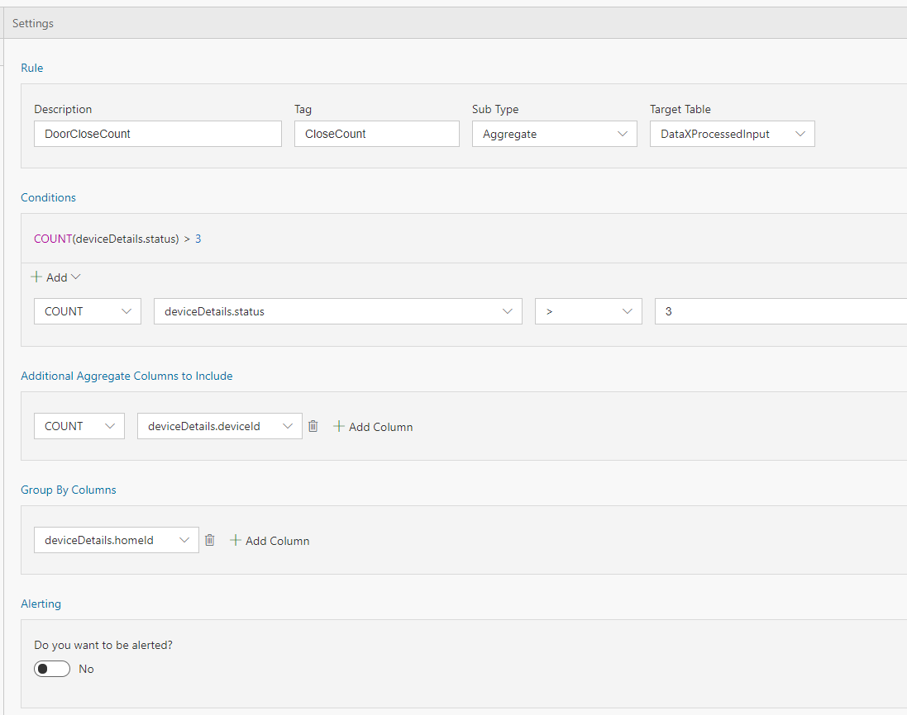

In the previous tutorial we saw how to Tag streaming data when certain conditions are met. In this tutorial you will learn how you can set up rules to tag the data based on aggregate values without writing any code. 

# Steps to follow 
* Open your flow or create a flow using [first tutorial to create a pipeline in 5 minutes](Creating-your-first-pipeline-in-5-minutes!). Notice that 30 seconds in the default batch interval size in the Input tab. 

* Switch to Rules tab and click on "+ Add | Tag Rule" button: <br/>
 <br/>

* With Sub type set to 'Aggregate' and Target table set to 'DataXProcessedInput' (which is the default input table), provide a description of the rule and add a Tag value. Any message/event satisfying the condition will be tagged with the value provided for Tag. <br/>

 <br/>

* Use the intuitive UI to set up the condition for tagging as shown above. For this example, the data ingested is home automation data. Anytime more than 3 devices are locked in a house, the data is tagged with "DoorLocked". A new column 'Tag' will be aded to the data with this information. Note, deviceDetails.status of 1 means locked, 0 means unlocked.  

- In the Query tab, call ProcessAggregateRules() API and route the data to your desired output sink.

```sql
	--DataXQuery--<br/>
	T1 = ProcessAggregateRules(DataXProcessedInput);<br/>
```

 
 - Click Deploy

T1 will now contain the DataXProcessedInput data, along with tags from the rule set in this Flow.

* Click "Deploy" button. That's it! You have now created an aggregate rule for tagging. Each time more than 3 devices are locked in a house, a message with Tag "DoorLocked" will be recorded. <br/>
 

# View Data
Now, switch over to the output sink, and notice the data flowing in with the Tags. 

# Links
* [Tutorials](Tutorials)
* [Wiki Home](Home) 