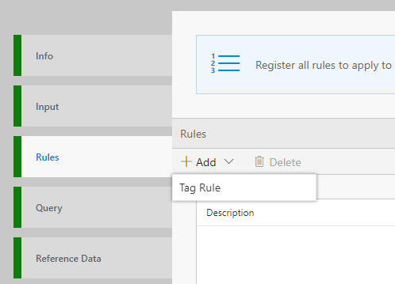

For various kinds of analysis, business insights, technical insights, cohort analysis, etc. it is important to analyze and "Tag" the streaming data. Downstream processing can then take advantage of these tags for immediate action or down the road insights. In this tutorial you will learn how you can set up rules to tag the data without writing any code. 

# Steps to follow 
* Open your flow or create a flow using [first tutorial to create a pipeline in 5 minutes](Creating-your-first-pipeline-in-5-minutes!)

* Switch to Rules tab and click on "+ Add | Tag Rule" button:  
  

* With Sub type set to 'Simple' and Target table set to 'DataXProcessedInput' (which is the default input table), provide a description of the rule and add a Tag value. Any message/event satisfying the condition will be tagged with the value provided for Tag. (We will walk through Aggregate type in the next tutorial) 

  

* Use the intuitive UI to set up the condition for tagging as shown above. For this example, the data ingested is home automation data. Anytime a door is locked, the data is tagged with "DoorLocked". A new column 'Tag' will be aded to the data with this information. Note, deviceDetails.status of 1 means locked, 0 means unlocked.  

- In the Query tab, call ProcessRules() API and route the data to your desired output sink.

	--DataXQuery-- 
	T1 = ProcessRules(DataXProcessedInput); 
 
 - Click Deploy

T1 will now contain the DataXProcessedInput data, along with tags from the rules set in this Flow.

* Click "Deploy" button. That's it! You have now created a rule for tagging. Each time a door is locked, the message will contain the Tag "DoorLocked".  
 

# View Data
Now, switch over to the output sink, and notice the data flowing in with the Tags. 