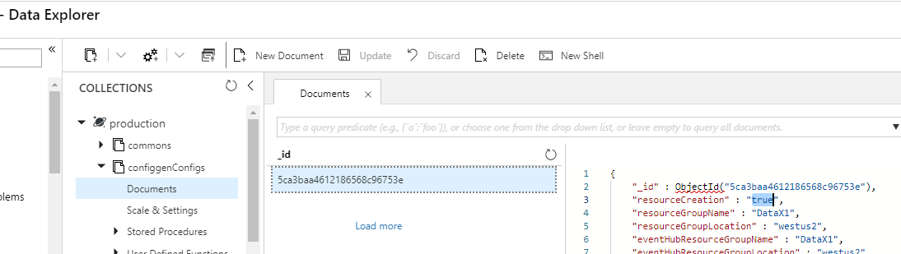

If your input Eventhub or IotHub is in a different tenant, you have to create the consumer groups used by Data Accelerator manually and set the resource creation flag to False in the configuration:

- Create two consumer groups: 
  - dataxops: This is common and is needed for the features such as "Get schema" and "Live query"
  - "_flowname_": Every flow needs an associated consumer group . When you create a new flow, please make sure you have a consumer group named the "_flowname_".
		
- Set the resource creation flag to False:
  - Azure Portal -> Resource groups -> Select the resource group of your DataX environment -> Find a resource whose type is Azure Cosmos DB account -> Select the cosmosDB resource -> Data Explorer -> Expand configgenConfigs collection -> Documents -> There should be one document -> Select the document -> Set "resourceCreation" flag to "false"  

	
- For details on how to create consumer group:
   - Consumer groups for IotHub:
   - Azure Portal -> Iot Hubs -> Select Iot Hub -> Build-in endpoints -> Find Consumer groups section -> Provide a name in the textbox
		

- Consumer group for Event Hub: 
  - Azure Portal -> Event Hubs -> Select your Event Hubs Namespace -> Event Hubs -> Select your Event Hub -> Consumer groups -> + Consumer group -> Provide a name -> Click Create
		

		
