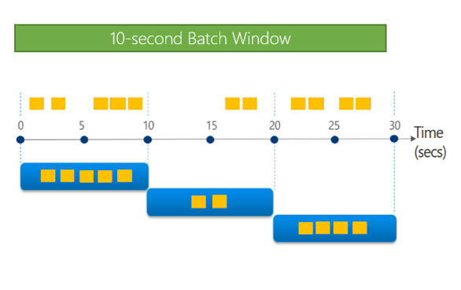
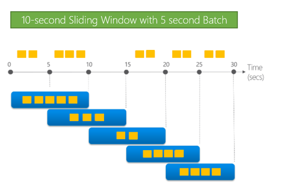

Advanced scenarios in streaming jobs require fine control over time windows. This tutorial walks you through various windowing functionality in Data Accelerator. 

# Batch Interval
User can control the interval at which the incoming data is processed. The image below shows the rate of incoming data and how data is processed based on batch interval setting. With batch interval of 10 seconds, the data in that interval is processed every 10 seconds. <br/>
 <br/>

To do so, you can alter the 'Batch interval in Seconds' setting. The default is 30 seconds. Furthermore, you can specify the maximum number of events to be processed in each batch by entering the value in 'Maximum Events per Batch Interval' field. The default value is already filled in. These settings will depend on incoming rate of the data, number of cores and memory in the cluster and of course scenario need. <br/>
 <br/>

# Sliding Window
For every batch processed, you can control look back period. This is called Sliding Window. The image below shows batch interval of 5 seconds (i.e. data is processed every 5 seconds), with a sliding window of 10 seconds (i.e. look back is 10 seconds). So, past 10 seconds of data is processed every 5 seconds. <br/>
 <br/>

You can alter the batch interval as shown above. To change the sliding window you can do it easily in-line in SQL using the **TIMEWINDOW** keyword. The query below will count the number of events every batch interval, looking back 10 seconds.

```sql
T1 = SELECT COUNT(*) AS Count
FROM DataXProcessedInput
TIMEWINDOW(‘10 seconds’)
```

# Late Arrival Data Handling
There are times when you may want to wait for late arriving data before processing the data. This gives an opportunity to process the data even though it may be late, however if it arrives beyond the late arrival limit, the data would be dropped. 

Check the example below. The color of the data represents the timestamp on the data and its position on the timeline shows when it arrived. For this example, we have set the Sliding Window to 10 seconds and Late Arrival Wait time is set to 5 seconds. 

At T=20 seconds, all the data with timestamp between 5 and 15 seconds will be processed (yellow data). Notice that we will include data that arrived late. However, if yellow data arrives later than 5 seconds, then it will be dropped (i.e. data arriving after 20 seconds is dropped).

Next, the data will be processed at T=30 seconds because the batch interval is set to 10 seconds. At this time, data with timestamp between 15 and 25 seconds will be processed. The colors on the data show how they are included/excluded based on their timestamp and arrival time. 

Using this setting often has trade-offs between latency (i.e. how long you want to wait for the late arrival data) and completeness (i.e. how to include as much data as possible in processing). <br/>
 <br/>

You can specify the wait time for late arriving data in 'Wait time for late arriving data' field in the input tab.<br/>
 <br/>

# Putting it all together
Data Accelerator gives you very powerful windowing functions to accomplish most complex of tasks that can be easily expressed in the UI or inline in SQL with keywords. The home automation sample included with Data Accelerator makes use of these dials that you can explore further.

# Links
* [Tutorials](Tutorials)
* [Wiki Home](Home) 