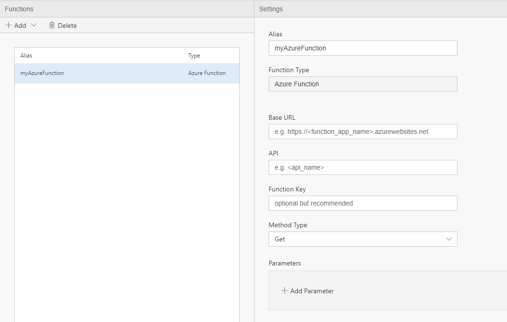

We have seen no code experience provided by Data Accelerator to set up Rules and Alerts, and also seen how you can do more complex queries using SQL and other capabilities like Windowing functions, etc. At times, for even more advanced scenarios, you may want to create function that you can invoke from SQL. Functions can extend query code by adding either Azure function or UDF/UDAF via Scala code in jars files.

In this tutorial, you'll learn to:
 - Add an Azure Function
 - Add a Jar file to use as a UDF or UDAF

# Adding an Azure function
To set up an Azure function:
 - Open your Flow and go to the Functions Tab
 - Select add Azure Function from the Function tab<br/>
<br/>
 - The Alias will be how to reference the function in the Query tab
 - The Service Endpoint, API, Function key and Method type can be obtained from the Azure portal<br/>
<br/>
	
That's it! You can now use the Azure Function in your query using the Alias as such, passing parameters such as values or column names as parameters
	T2 = Select myAzureFunction(param1, param2, …) FROM DataXProcessedInput;

# Adding a Scala User Defined Function
Similarly, to set up a user-defined function or UDF:
 - Open your Flow and go to the Functions Tab
 - Select UDF from the drop down in the Function tab.
 - You will need to provide following (this example is also included in the home automation sample)
    - an alias (in the example below we use **whoOpened**), 
    - Path to the jar file that implement the jUDF interface.  See an example below.  Note this jar file needs to be uploaded under the default container of the default blob of the Spark cluster.
    - The class name is the fully qualified path and classname, i.e. datax.sample.udf.UdfHelloWorld

```scala
package datax.sample.udf

import org.apache.spark.sql.api.java.{UDF1 => jUDF}

class UdfHelloWorld extends jUDF[String, String]{
  override def call(p1: String): String = {
    "hello, " + p1
  }
}
```
Once you have done so, you can use the UDF in your query, using a similar pattern as an Azure function.<br/>

```sql
--DataXQuery--
DeviceNotWindowedInputWithNameAndWho = SELECT 
                        deviceId,
                        deviceType,
                        eventTimeStamp,
                        homeId,
                        status,
                        deviceName,
                        whoOpened(CAST(deviceId AS String)) AS whoOpened
                    FROM DeviceNotWindowedInputWithName 
```

# Adding a Scala User-Defined Aggregated Function
Similar to UDF, you can set up a UDAF (user-defined aggregated function):
 - Open your Flow and go to the Functions Tab
 - Select UDAF from the drop down.  
 - Similar settings as with UDF need to be provided.  The jar file also needs to be updated under the default container of the default blob of the Spark cluster

To use the UDAF, you can pass in an array to the UDAF alias:

```sql
--DataXQuery--
T4 = SELECT myUDAF(DataXProcessedInput)
     FROM DataXProcessedInput;
```

- Hit 'Deploy' to deploy your changes! 

# Links
* [Tutorials](Tutorials)
* [Wiki Home](Home) 