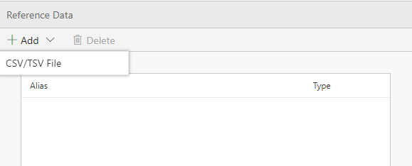
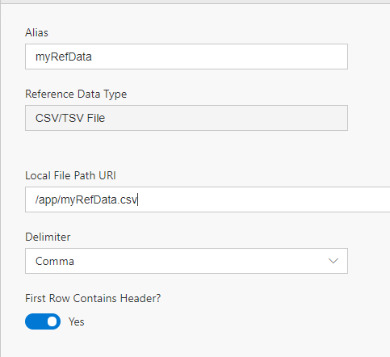
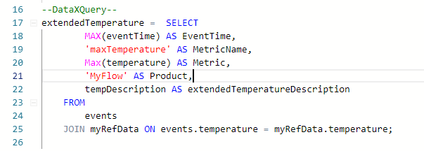

The Reference tab is where you can add static data to join with your streaming data.

In this tutorial, you'll learn to:
 - Add Reference data
 - Use the Editor features to join to your Reference Data

# Adding Reference Data

 - Open your Flow and go to the Reference tab
 - Add a new CSV/TSV file  

 - Given a csv file that looks as such: 

 - Set up your CSV by setting up:
    - Alias: this will be how to use the reference data in your query
    - Path: where to load the reference data from
    - Delimiter: data can be comma or tab limited
    - Header: if your data has a header row 

 - Open the Query tab of your flow
 - You can now join your streaming data to the reference data by doing a JOIN:  
    - JOIN myRefData ON myRefData.<columnName> 

 - Click Deploy

Your data now has reference data joined to it.

