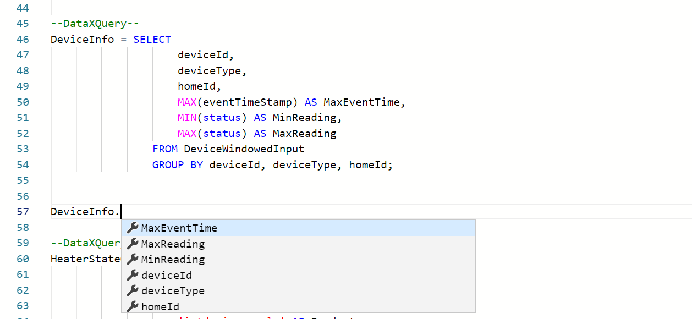

Up until now we have focused on doing processing and setting up alerts without having to write any code. That is powerful and will satisfy a bunch of scenarios. However, when the no code experience isn't sufficient to meet the needs, you can use the power of Spark SQL for more complex processing, and do so without having to learn Scala. In this tutorial you will learn how to use SQL for processing data, chain queries, output data to sinks. 

# Steps to follow
- Open a Flow or create a new one using [first tutorial to create a pipeline in 5 minutes](Creating-your-first-pipeline-in-5-minutes!)

- Switch to the Query tab. This is where you can write all your SQL code. Data Accelerator supports full Spark SQL, and enhances it with few more keywords that you will learn about in future tutorials. For now, write a statement such as:<br/>

```sql
--DataXQuery--
T1 = SELECT * FROM DataXProcessedInput;
```

* Each query is separated by comment "--DataXQuery--" and ends with a semi-colon. You can chain queries.

```sql
--DataXQuery--
DeviceInputSummary = SELECT 
                        deviceDetails.deviceId,
                        deviceDetails.deviceType,
                        eventTimeStamp,
                        deviceDetails.homeId,
                        deviceDetails.status
                    FROM T1 
                   GROUP BY deviceId, deviceType, eventTimeStamp, homeId, status;

--DataXQuery--
DeviceInfo = SELECT 
                    deviceId,
                    deviceType,
                    homeId,
                    MAX(eventTimeStamp) AS MaxEventTime,
                    MIN(status) AS MinReading,
                    MAX(status) AS MaxReading
                FROM DeviceWindowedInputSummary
                GROUP BY deviceId, deviceType, homeId;

OUTPUT DeviceInfo TO myCosmosDB;
```
* You can use the full power of SQL and do JOINS, UNIONS, GROUP BYs, etc. Full documentation of [Spark SQL](https://spark.apache.org/sql/)

* To assist you with programming and avoid typos, you will get intellisense for the columns of the table. Simply write the name of the table and dot and hit Ctrl+Space to invoke intellisense. For those who have worked with long SQL queries and tables, will appreciate that this will save hours of frustration with typos!
<br/>

* Go ahead! Try out some queries and send the data sets to different sinks. You are on your way to create some powerful stream processing using SQL skills!

# Links
* [Tutorials](Tutorials)
* [Wiki Home](Home) 